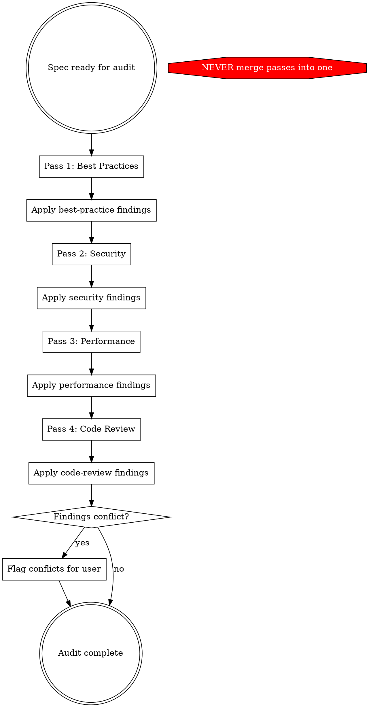

# Convex Audit Design

Four-pass audit of a Convex design spec. Each pass invokes a dedicated skill, applies findings to the spec, then hands the updated spec to the next pass. No pass may be skipped or merged.

## When to Use

- A superpowers design spec (`docs/superpowers/specs/*.md`) is ready for review
- Before implementing a Convex feature from a spec
- After significant spec revisions that change schema, RLS, or mutation logic

## Audit Flow

## Pass Details

| Pass | Invoke | Focus | Audit Section |
|------|--------|-------|---------------|
| 1 | `convex-best-practices` via Skill tool | Validators, indexes, idempotency, error types, function visibility, TypeScript strictness | `## Best Practices Audit` |
| 2 | `convex-security-audit` via Skill tool | RBAC, data boundaries, action isolation, rate limiting, RLS tightness | `## Security Audit` |
| 3 | `convex-performance-audit` via Skill tool | N+1 reads, OCC contention, subscription cost, function budgets, denormalization | `## Performance Audit` |
| 4 | `superpowers-extended-cc:code-reviewer` subagent | Internal consistency, completeness, implementability, test coverage | `## Code Review` |

Each pass: invoke skill → review spec using its checklist → edit spec body with fixes → append audit section logging changes. Re-read spec from disk before starting the next pass.

**Pass 4 note:** Dispatch a code-reviewer subagent (not `requesting-code-review`, which expects git SHAs). The subagent reviews the spec holistically after all prior passes have been applied.

## Rules

1. **Four passes, four skill invocations.** Each pass MUST invoke its skill via the Skill tool. Do not substitute your own knowledge for the skill's checklist.
2. **Re-read spec from disk before each pass.** After applying findings, re-read the spec file before starting the next pass. Do not rely on your in-context copy — it is stale after edits.
3. **Apply in-body, log in audit section.** Fix issues directly in the spec body (e.g., add a missing validator to a function signature in Section 2). Then log what you changed and why in the audit section at the end. Both edits happen — not one or the other.
4. **Log findings per pass.** Each audit section at the end of the spec documents what that pass found and changed. This creates an audit trail.
5. **Conflicts go to the user.** If Pass 3 (performance) contradicts Pass 2 (security) — e.g., denormalization vs. data isolation — flag it rather than silently choosing one.

## Red Flags — You Are About to Shortcut

| Thought | What to do instead |
|---------|-------------------|
| "I'll review everything in one pass" | Stop. Invoke Pass 1 skill. Four passes exist because each skill has a specialized checklist. |
| "This spec looks clean, I'll skip Pass N" | Stop. Every pass finds something. Invoke the skill and let it guide you. |
| "I already know Convex best practices" | The skill has a specific checklist. Invoke it. Your knowledge supplements, not replaces. |
| "Applying findings between passes is busywork" | Each pass reviews the *updated* spec. Pass 2 might miss a security issue that Pass 1's fix introduced. |
| "The user said 'quick review'" | This skill defines what a review is. Four passes. No shortcuts. |
| "I'll just report findings without editing" | Apply findings to the spec. A report without edits is a suggestion, not an audit. |
| "I already have the spec in context" | Re-read from disk. Your in-context copy is stale after the previous pass's edits. |
| "I'll apply all edits at the end" | Each pass must see the prior pass's fixes. Batch-applying defeats the purpose. |

## Output

The spec file gains four audit sections (one per pass) at the bottom. Each section logs: what was found, what was changed (with before/after if non-trivial), and what was flagged but not changed (with rationale).
