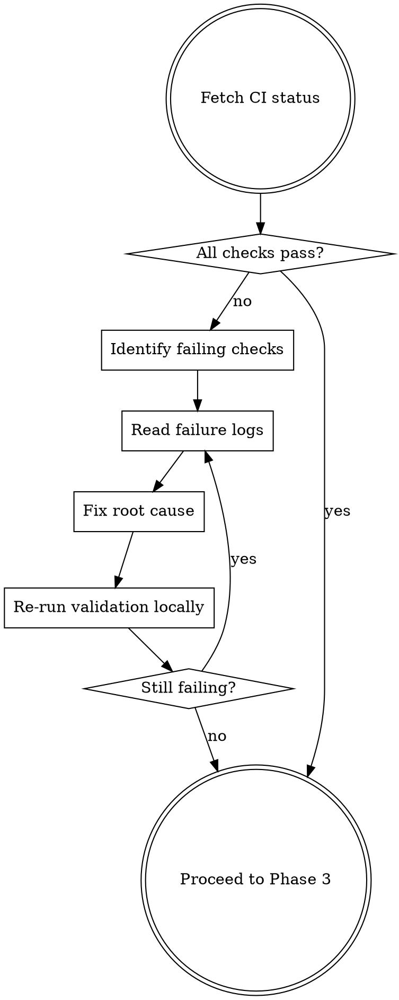
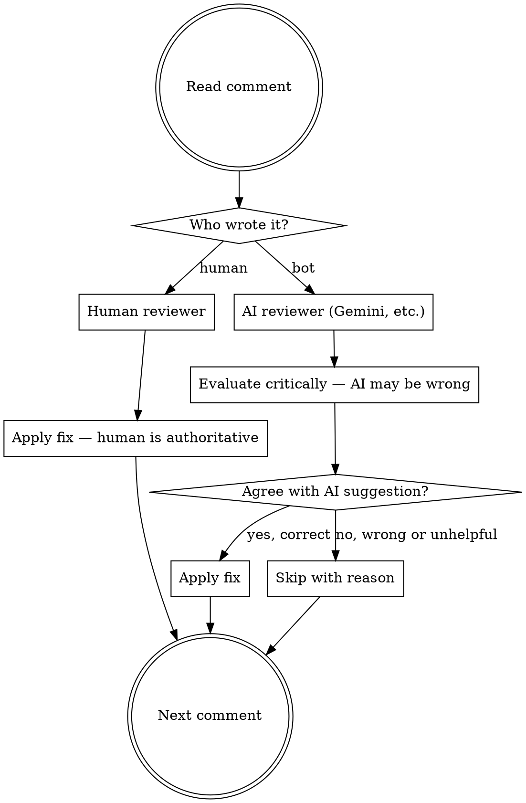
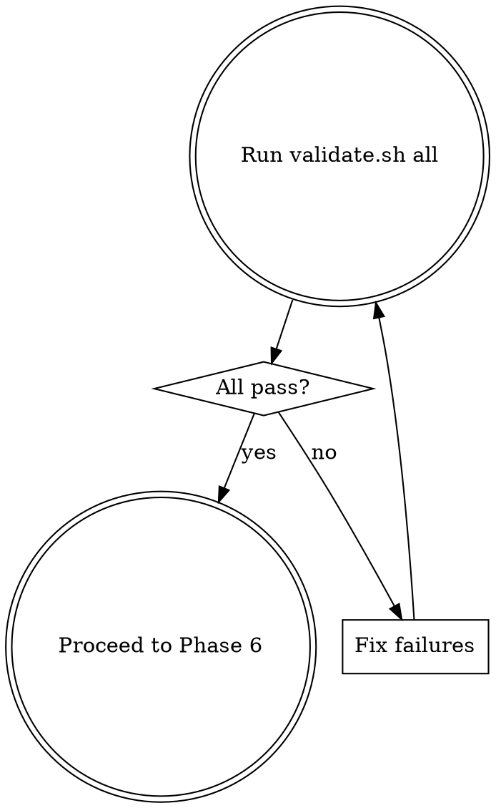

# Go PR Finish

Take an existing PR, fix CI failures, address review comments, run your own code review, validate everything, and push the fixes back. Every run ends with a commit pushed to the PR branch and a clean worktree.

**The pipeline is sequential and non-negotiable. No phase can be skipped.**

## Phase Gate Rules

Each phase MUST complete before the next begins. Announce each transition explicitly:

> "Phase 1 complete — worktree created at ../braket-tickets-pr-42. Starting Phase 2: CI failures."
> "Phase 2 complete — 3 CI failures fixed. Starting Phase 3: review comments."
> "Phase 3 complete — 4 human comments addressed, 1 AI comment skipped. Starting Phase 4: local code review."
> "Phase 4 complete — 2 issues found and fixed. Starting Phase 5: validation."
> "Phase 5 complete — validate.sh all green. Starting Phase 6: commit, push, cleanup."

**If you find yourself wanting to skip a phase, that is a red flag.** Read the rationalization table at the bottom of this skill and follow its instructions.

## Input

Accepts any of:
- PR number: `42`
- PR URL: `https://github.com/org/repo/pull/42`
- Branch name: `feat/bra-42-magic-links`

## Phase 1: Checkout

Create an isolated worktree for the PR branch.

```bash
# Get PR info
gh pr view <PR> --json headRefName,number,title,url

# Create worktree from the PR branch
git fetch origin <branch>
git worktree add ../braket-tickets-pr-<number> origin/<branch>
cd ../braket-tickets-pr-<number>
git checkout -B <branch> origin/<branch>

# Install dependencies (worktrees don't share node_modules)
pnpm install && cd frontend && pnpm install && cd ..
```

**Do NOT work in the main working directory.** Always use a worktree.

## Phase 2: Fix CI Failures



### Step 1: Get CI status

```bash
gh pr checks <PR> --json name,state,description
```

### Step 2: Read failure logs

For each failing check, get the run logs:

```bash
# List workflow runs for the PR
gh run list --branch <branch> --limit 5
# View the failed run
gh run view <run-id> --log-failed
```

### Step 3: Fix each failure

Failure types and how to handle them:

| Failure Type | Approach |
|-------------|----------|
| **Build errors** | Fix TypeScript/compilation errors. Read the exact error, fix the source. |
| **Unit test failures** | Fix the implementation code, NOT the tests. If a test expectation is genuinely wrong, flag it but still fix the code first. |
| **E2E test failures** | Run the failing test locally with `pnpm test:e2e:run --grep "test name"`. Fix the implementation, not the test. |
| **Lint/format** | Run `./scripts/validate.sh all` and fix what it reports. |

### Step 4: Verify locally

Run the specific failing check locally before moving on:

```bash
# For build:
pnpm build
# For unit tests:
pnpm test:unit
# For E2E (affected only):
# Use the run-e2e skill
# For lint:
./scripts/validate.sh all
```

**Do NOT move to Phase 3 until all CI failure categories are fixed locally.**

## Phase 3: Address Code Review Comments

### Step 1: Fetch all review comments

```bash
gh pr view <PR> --json reviews,comments
gh api repos/{owner}/{repo}/pulls/<PR>/comments
```

### Step 2: Classify each comment by source



### Comment Source Rules

**Human comments — treat as authoritative:**
- Apply the requested change unless it would break something
- If it contradicts project conventions, apply anyway and note the conflict
- If it's ambiguous, make your best interpretation and implement it
- If it would introduce a bug, flag it but still attempt the spirit of the request

**AI comments (Gemini Code Assist, Copilot, etc.) — treat with skepticism:**
- AI reviewers are frequently wrong about project-specific patterns
- Evaluate each suggestion against the actual codebase conventions
- Common AI false positives:
  - Suggesting patterns that contradict the project's CLAUDE.md or style
  - Flagging intentional design decisions as "issues"
  - Recommending unnecessary abstractions or over-engineering
  - Missing project context (e.g., suggesting `npm` when project uses `pnpm`)
- **If you agree** the AI caught a real issue → apply the fix
- **If you disagree** → skip it and leave a brief note in your commit message explaining why

**How to identify AI reviewers:**
- Username contains "bot", "assist", "copilot", "gemini", "coderabbit"
- Comment has structured format with severity labels
- Profile shows `[bot]` badge
- When in doubt, check the user's GitHub profile

## Phase 4: Local Code Review

After applying all fixes from Phases 2 and 3, run your own review.

Invoke `superpowers-extended-cc:requesting-code-review` on the full PR diff (not just your fixes — review ALL changes in the PR).

**Domain-specific criteria:**
- **Convex code**: RLS on public endpoints, argument validation, `query`/`mutation`/`action` boundaries, no `any`, index usage
- **Angular code**: Zoneless patterns, signal-based reactivity, CDK harness usage, no deprecated APIs
- **Both**: TypeScript strict compliance, no `any`

Fix all high-severity issues found. Re-run unit tests after fixes.

## Phase 5: Validate

**Everything must pass. No excuses.**

```bash
./scripts/validate.sh all
```

If anything fails, fix it. "It was already broken before my changes" is NOT an acceptable excuse — you own the PR now.



**Loop until green. Do not proceed with failures.**

## Phase 6: Commit, Push, Cleanup (MANDATORY)

**This phase is NEVER optional. Every run of this skill MUST end here.**

### Step 1: Commit

If no files were changed across Phases 2–5, skip the commit and push — but still clean up the worktree and output the summary. Do NOT force an empty commit.

```bash
git add -A
git commit -m "$(cat <<'EOF'
fix(<scope>): address CI failures and review feedback

- Fixed: <list CI failures fixed>
- Addressed: <list human review comments addressed>
- Skipped: <list AI suggestions skipped with reasons>
- Code review: <any issues found and fixed>

Co-Authored-By: Claude <noreply@anthropic.com>
EOF
)"
```

### Step 2: Push to PR branch

```bash
git push origin <branch>
```

This updates the existing PR automatically.

### Step 3: Cleanup worktree

```bash
cd <original-directory>
git worktree remove ../braket-tickets-pr-<number>
```

### Step 4: Confirm

Output a summary:
```
PR #<number> updated: <url>
- CI fixes: <count>
- Human review comments addressed: <count>
- AI review comments applied: <count>
- AI review comments skipped: <count>
- Code review issues fixed: <count>
- validate.sh: ✅ all green
```

## Red Flags — STOP

- Skipping Phase 6 because "I'll push later" — **push NOW**
- Skipping validation because "my changes are small" — **run it anyway**
- Accepting all AI review comments without evaluation — **think critically**
- Modifying tests to make them pass — **fix the implementation**
- Working in the main directory instead of a worktree — **always isolate**
- Saying "this failure isn't from my change" — **you own the PR, fix it**

## Rationalization Table

If you catch yourself thinking any of these, STOP and follow the pipeline:

| Excuse | Reality |
|--------|---------|
| "CI is already green, skip Phase 2" | Verify it yourself. `gh pr checks` first. If green, Phase 2 is fast. |
| "No review comments, skip Phase 3" | Verify it yourself. `gh api` for comments first. If none, Phase 3 is fast. |
| "I already fixed everything, skip Phase 4 code review" | Your fixes may have introduced new issues. Review is not optional. |
| "My changes are small, skip Phase 5 validation" | Small changes break builds. Run `validate.sh all`. Every time. |
| "That failure isn't from my change" | You own the PR now. Fix it or the PR stays broken. |
| "I'll push later / in the next step" | Push NOW. Phase 6 is MANDATORY and comes LAST. No "later." |
| "The worktree cleanup isn't important" | Abandoned worktrees accumulate. Clean up after yourself. NEVER list as "remaining work." |
| "I can do Phases 2 and 3 together" | No. Fix CI first, then address comments. CI fixes may resolve some comments. |
| "Code review found nothing, skip Phase 5" | Validation catches what review misses (lint, types, build). Always run it. |

## NEVER

- Skip the commit+push+cleanup phase — this is the entire point
- Leave a worktree behind — not after pushing, not as "remaining work," not ever. You created
  it, you remove it in Phase 6 Step 3. Period.
- Blindly accept AI reviewer suggestions
- Blindly reject AI reviewer suggestions (evaluate each one)
- Modify tests to make CI pass instead of fixing implementation
- Skip `validate.sh all` because "CI will catch it"
- Push to a different branch than the PR's head branch
- Combine or reorder phases — the sequence exists for a reason
- Skip a phase because it "would be empty" — verify first, then it's fast
