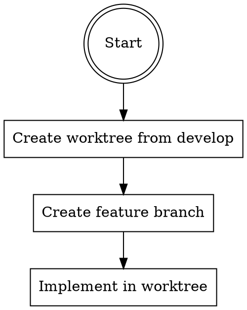
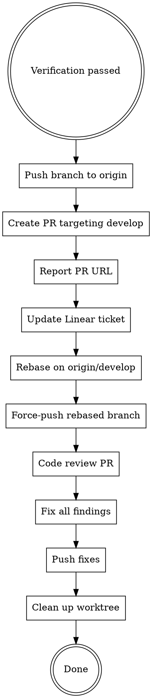

# Go PR

Safe development pipeline for autonomous or less powerful models. Always isolated, always submits a PR for human review.

**Two non-negotiable rules:**
1. **Always work from a worktree and new branch** — no exceptions, no "it's small enough" bypass
2. **Always submit a PR** — never merge directly into develop

## Linear Ticket Detection

If the user provides a Linear issue (XML block with `<issue identifier="...">` or a plain identifier like `BRA-17`):

1. Extract the identifier (e.g. `BRA-17`)
2. Immediately mark it **In Progress**: call `mcp__claude_ai_Linear__save_issue` with `id` = the identifier and `state` = `"In Progress"`
3. Carry the identifier through the pipeline — it's needed again in Phase 5

If no Linear ticket is provided, skip this section entirely.

## Phase 1: Research

**Determine affected domains**, then load the right skills and tools:

| Domain | Skills to invoke | MCP tools |
|--------|-----------------|-----------|
| Backend (`convex/`) | `convex-functions`, `convex-best-practices`, plus any specific skill (`convex-realtime`, `convex-schema-validator`, `convex-file-storage`, `convex-security-check`, etc.) | `functionSpec`, `tables`, `status` |
| Frontend (`frontend/`) | `frontend-design` + Angular CLI `get_best_practices` + `search_documentation`. Also load relevant Impeccable skills based on the task. | Context7 for ZardUI or new deps |
| Auth | `convex-setup-auth` | — |
| Migrations | `convex-migration-helper`, `convex-migrations` | — |
| Both | Load both domain skill sets | Both MCP tool sets |

**This is mandatory, not optional.** If the task touches `convex/`, at minimum `convex-functions` and `convex-best-practices` must be loaded. If it touches `frontend/`, Angular CLI best practices and `frontend-design` must be loaded.

Summarize findings briefly, then proceed.

## Phase 2: Plan

Invoke `superpowers-extended-cc:write-plan`.

⏸ **PAUSE** — Present plan. Wait for approval or adjustments.

## Phase 2.5: Audit Design (Convex tasks)

If the plan touches `convex/`, invoke `convex-audit-design` on the approved plan. This runs
four sequential audit passes (best practices, security, performance, code quality) and applies
findings between each pass.

**You MUST invoke the skill — do NOT substitute your own review.** The skill's value is in the
sequential four-pass structure, not just "reviewing the plan." Skipping it because "I already
reviewed the plan" means you skipped the structured audit.

Proceed automatically after audit — no pause needed.

## Phase 3: Implement

### Step 1: Create Worktree (MANDATORY)



Create a worktree and feature branch. Use `superpowers-extended-cc:using-git-worktrees`.

**Branch naming:** `<type>/<ticket-or-slug>` (e.g. `feat/bra-42-magic-links`, `fix/bra-55-date-format`)

**Red flags — STOP if you catch yourself doing any of these:**
- Implementing in the main working directory instead of the worktree
- Working on `develop` directly instead of a feature branch
- Rationalizing "it's just a one-line fix, I don't need a worktree"
- Skipping worktree because "the task is small"

**There are NO small tasks. ALL tasks use a worktree.**

### Step 2: Implement

Follow `superpowers-extended-cc:test-driven-development` — write tests before implementation code.

You may implement directly or dispatch subagents. If the plan has 2+ independent tasks, prefer parallel subagents via `superpowers-extended-cc:dispatching-parallel-agents` with `model: "sonnet"`.

### Step 3: Commit Progress

Commit your work in the worktree as you go. Use conventional commits (`feat`, `fix`, `refactor`, etc.). Multiple small commits are better than one large commit.

## Phase 4: Verify

Run BEFORE submitting PR:

1. `superpowers-extended-cc:verification-before-completion` — unit tests must pass
2. `./scripts/validate.sh all` — lint, type-check, build
3. Run affected E2E tests via the `run-e2e` skill (affected-only, never full suite)

All three must pass before proceeding. Do NOT skip verification because "the PR reviewers will catch it."

**When tests fail:** Fix the implementation code, not the tests. Never modify a test to make it pass.

## Phase 5: Review

Invoke `superpowers-extended-cc:requesting-code-review`.

**Domain-specific review criteria** — the code reviewer MUST check:
- **Convex code**: RLS usage on public endpoints, argument validation, proper use of `query`/`mutation`/`action` boundaries, no `any` types, index usage. Invoke `convex-security-check` on any new/modified Convex functions.
- **Angular code**: Zoneless patterns, signal-based reactivity, CDK harness testability, no deprecated APIs. Verify against Angular CLI `get_best_practices`.
- **Both**: TypeScript strict compliance, no `any`.

Fix all high-severity issues found → re-verify (unit tests only, E2E already passed) → proceed.

## Phase 6: Submit PR

**DO NOT merge into develop. Create a Pull Request.**



### Step 1: Push

```bash
git push -u origin <feature-branch>
```

### Step 2: Create PR

```bash
gh pr create --base develop --title "<type>(<scope>): <description>" --body "$(cat <<'EOF'
## Summary
<2-3 bullets of what changed and why>

## Linear Ticket
<BRA-XX link if applicable, or "N/A">

## Test Plan
- [ ] Unit tests pass
- [ ] validate.sh all passes
- [ ] Affected E2E tests pass

🤖 Generated with [Claude Code](https://claude.com/claude-code)
EOF
)"
```

**PR title must follow conventional commit format** — same as git commits.

### Step 3: Report

Output the PR URL so the user (or orchestrating system) can find it.

### Step 4: Update Linear

If a Linear ticket was detected at the start, mark it **In Review**: call `mcp__claude_ai_Linear__save_issue` with `id` = the identifier and `state` = `"In Review"`.

Do NOT mark it "Done" — the PR hasn't been merged yet. A human reviewer will handle that.

### Step 5: Rebase on Latest Develop (MANDATORY)

Before code review, rebase the feature branch onto the latest `origin/develop` to catch merge-conflict-induced issues:

```bash
git fetch origin develop
git rebase origin/develop
```

If conflicts arise, resolve them carefully — never drop incoming changes without understanding them.

Then force-push the rebased branch to update the PR:

```bash
git push --force-with-lease
```

**Why before review:** Reviewing pre-rebase code misses bugs introduced by merge resolution. The reviewer must see the final state.

### Step 6: Code Review PR (MANDATORY)

Invoke the `pr-code-review` skill on the PR. This runs a full multi-agent review covering bugs, CLAUDE.md compliance, Convex backend patterns, and Angular frontend best practices — with confidence scoring to filter noise.

**This is NOT optional.** Do NOT substitute your own review, do NOT skip because "Phase 5 already reviewed the code." Phase 5 is a pre-PR self-review on the working tree. This step reviews the actual PR diff against `develop` after rebasing — a fundamentally different perspective.

**Red flags — STOP if you catch yourself thinking:**
- "I already reviewed this in Phase 5" — Phase 5 was pre-rebase, pre-PR. Different context.
- "The changes are small, review is overkill" — small changes break things too.
- "I'll just do a quick scan myself" — invoke the skill. Your scan is not equivalent.
- "I'll use `code-review:code-review` instead" — `pr-code-review` supersedes it with domain-specific Convex + Angular checks.

### Step 7: Fix All Findings

Address every finding from the code review. Do NOT cherry-pick which findings to fix.

After fixing, re-run verification:
1. Unit tests must pass
2. `./scripts/validate.sh all` must pass

Then push the fixes:

```bash
git push
```

**If the review found zero issues:** Skip this step and proceed to cleanup. But this must be because the review genuinely found nothing — not because you skipped the review.

### Step 8: Clean Up Worktree (MANDATORY)

After the PR is fully reviewed, fixed, and pushed, remove the worktree immediately:

```bash
# Return to main working directory
cd <original-directory>

# Remove the worktree (branch is preserved on remote)
git worktree remove <worktree-path>
```

**Do NOT skip this step.** Do NOT list worktree cleanup as "remaining work for the user."
If you created the worktree, you own its removal. The branch is preserved on the remote —
the worktree is disposable scaffolding.

## Phase Transitions

Announce each transition:

> "Marked BRA-17 In Progress. Researching Convex schema and Angular patterns..."
> "Plan approved. Creating worktree and feature branch..."
> "All checks green. Starting code review..."
> "Review clean. Pushing branch and creating PR..."
> "PR created: <url>. Marked BRA-17 In Review."
> "Rebasing on latest origin/develop..."
> "Rebase clean. Running code review on PR..."
> "Review found N issues. Fixing..."
> "Fixes pushed. Cleaning up worktree."

## Skip Rules

| User says | Effect |
|-----------|--------|
| "skip plan" or provides plan | Start at Implement |
| "bugfix" with obvious cause | Use `superpowers-extended-cc:systematic-debugging`, skip plan |
| Task is a single-file obvious fix (typo, config tweak) | Skip plan, go straight to worktree + implement |

**You CANNOT skip:**
- Worktree creation (never)
- Verification (never)
- PR submission (never — this is the whole point)
- Post-PR rebase on origin/develop (never)
- Post-PR code review via `pr-code-review` (never)
- Fixing code review findings (never — unless review found zero issues)

## NEVER

- Merge directly into `develop` — always create a PR
- Push to `main` — PRs target `develop` only
- Skip worktree creation — not even for one-line fixes
- Skip verification before PR submission
- Skip post-PR rebase on origin/develop
- Skip post-PR code review (`pr-code-review`) — Phase 5 self-review is NOT a substitute
- Ignore code review findings — fix all of them, then push
- Mark Linear tickets as "Done" — only "In Review" (human merges = human marks done)
- Implement in the main working directory
- Force-push without explicit user request
- Leave orphaned worktrees or list cleanup as "remaining work for the user." You created it,
  you remove it.
- Skip `convex-audit-design` for Convex-touching plans. A single-pass "looks fine" review is
  not equivalent to four sequential audit passes that build on each other.
