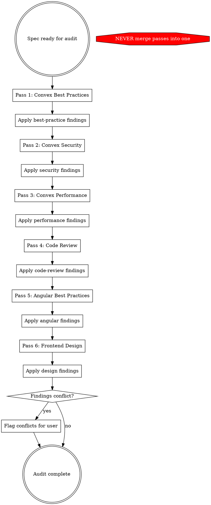

# Go Review

Six-pass audit of a design spec or implementation plan. Each pass invokes a dedicated skill or tool, applies findings to the document, then hands the updated document to the next pass. No pass may be skipped or merged.

## When to Use

- A design spec (`docs/superpowers/specs/*.md`) or implementation plan (`docs/superpowers/plans/*.md`) is ready for review
- After significant revisions that change schema, RLS, mutation logic, or UI components
- When a document spans both Convex backend and Angular frontend concerns

## Audit Flow



## Pass Details

| Pass | Invoke | Focus | Audit Section |
|------|--------|-------|---------------|
| 1 | `convex-best-practices` via Skill tool | Validators, indexes, idempotency, error types, function visibility, TypeScript strictness | `## Best Practices Audit` |
| 2 | `convex-security-audit` via Skill tool | RBAC, data boundaries, action isolation, rate limiting, RLS tightness | `## Security Audit` |
| 3 | `convex-performance-audit` via Skill tool | N+1 reads, OCC contention, subscription cost, function budgets, denormalization | `## Performance Audit` |
| 4 | `superpowers-extended-cc:code-reviewer` subagent | Internal consistency, completeness, implementability, test coverage | `## Code Review` |
| 5 | `angular-cli` MCP `get_best_practices` tool | Zoneless patterns, signal APIs, change detection, standalone components, modern Angular idioms | `## Angular Best Practices Audit` |
| 6 | `frontend-design` via Skill tool | Typography, color, layout, motion, interaction, responsiveness, AI slop avoidance | `## Frontend Design Audit` |

Each pass: invoke skill/tool → review spec using its checklist → edit spec body with fixes → append audit section logging changes. Re-read spec from disk before starting the next pass.

**Pass 4 note:** Dispatch a `superpowers-extended-cc:code-reviewer` subagent (not `requesting-code-review`, which expects git SHAs). The subagent reviews the spec holistically after all prior passes have been applied.

**Pass 5 note:** Call the `angular-cli` MCP `get_best_practices` tool with the workspace path from `list_projects`. Use the returned best practices as the checklist to audit Angular-specific pseudocode, component designs, signal usage, and template patterns in the spec. Cross-reference with `frontend/CLAUDE.md` for project-specific Angular conventions.

**Pass 6 note:** Invoke the `frontend-design` skill. Before auditing, ensure design context is available (check `.impeccable.md` or loaded instructions). Review the spec's UI sections against the skill's aesthetics guidelines — typography, color, layout, motion, interaction, responsive design, and the AI Slop Test. This pass focuses on design quality, not implementation correctness.

## Rules

1. **Six passes, six invocations.** Each pass MUST invoke its skill or tool. Do not substitute your own knowledge for the skill's checklist.
2. **Re-read spec from disk before each pass.** After applying findings, re-read the spec file before starting the next pass. Do not rely on your in-context copy — it is stale after edits.
3. **Apply in-body, log in audit section.** Fix issues directly in the spec body (e.g., add a missing validator to a function signature, fix a component selector). Then log what you changed and why in the audit section at the end. Both edits happen — not one or the other.
4. **Log findings per pass.** Each audit section at the end of the spec documents what that pass found and changed. This creates an audit trail.
5. **Conflicts go to the user.** If Pass 3 (performance) contradicts Pass 2 (security), or Pass 6 (design) contradicts Pass 5 (Angular best practices) — e.g., complex animation vs. zoneless performance — flag it rather than silently choosing one.
6. **Backend passes before frontend passes.** Passes 1-4 (Convex) run before Passes 5-6 (Angular/design). Backend decisions inform frontend shape — never reverse this order.

## Red Flags — You Are About to Shortcut

| Thought | What to do instead |
|---------|-------------------|
| "I'll review everything in one pass" | Stop. Invoke Pass 1 skill. Six passes exist because each skill has a specialized checklist. |
| "This spec looks clean, I'll skip Pass N" | Stop. Every pass finds something. Invoke the skill and let it guide you. |
| "I already know Convex best practices" | The skill has a specific checklist. Invoke it. Your knowledge supplements, not replaces. |
| "Applying findings between passes is busywork" | Each pass reviews the *updated* spec. Pass 2 might miss a security issue that Pass 1's fix introduced. |
| "The user said 'quick review'" | This skill defines what a review is. Six passes. No shortcuts. |
| "I'll just report findings without editing" | Apply findings to the spec. A report without edits is a suggestion, not an audit. |
| "I already have the spec in context" | Re-read from disk. Your in-context copy is stale after the previous pass's edits. |
| "I'll apply all edits at the end" | Each pass must see the prior pass's fixes. Batch-applying defeats the purpose. |
| "This doc is backend-only, skip Pass 5-6" | If the document has ANY frontend pseudocode, component designs, or UI references, run all six. Only skip if it is purely backend with zero frontend surface. |
| "I'll merge the Angular and design passes" | They have different checklists. Angular best practices checks correctness; frontend-design checks aesthetics. Both matter. |
| "I know Angular well enough to skip the MCP call" | The MCP tool returns version-specific best practices. Angular v21 patterns differ from v17. Call the tool. |

## Output

The spec file gains six audit sections (one per pass) at the bottom. Each section logs: what was found, what was changed (with before/after if non-trivial), and what was flagged but not changed (with rationale).

### Section Format

```markdown
## Best Practices Audit
**Pass 1 — convex-best-practices skill**
- [FIXED] Description of what was changed and why
- [FLAGGED] Description of what was noted but not changed, with rationale

## Security Audit
**Pass 2 — convex-security-audit skill**
...

## Performance Audit
**Pass 3 — convex-performance-audit skill**
...

## Code Review
**Pass 4 — code-reviewer subagent**
...

## Angular Best Practices Audit
**Pass 5 — angular-cli MCP get_best_practices**
- [FIXED] Description of what was changed and why
- [FLAGGED] Description of what was noted but not changed, with rationale

## Frontend Design Audit
**Pass 6 — frontend-design skill**
- [FIXED] Description of what was changed and why
- [FLAGGED] Description of what was noted but not changed, with rationale
```
