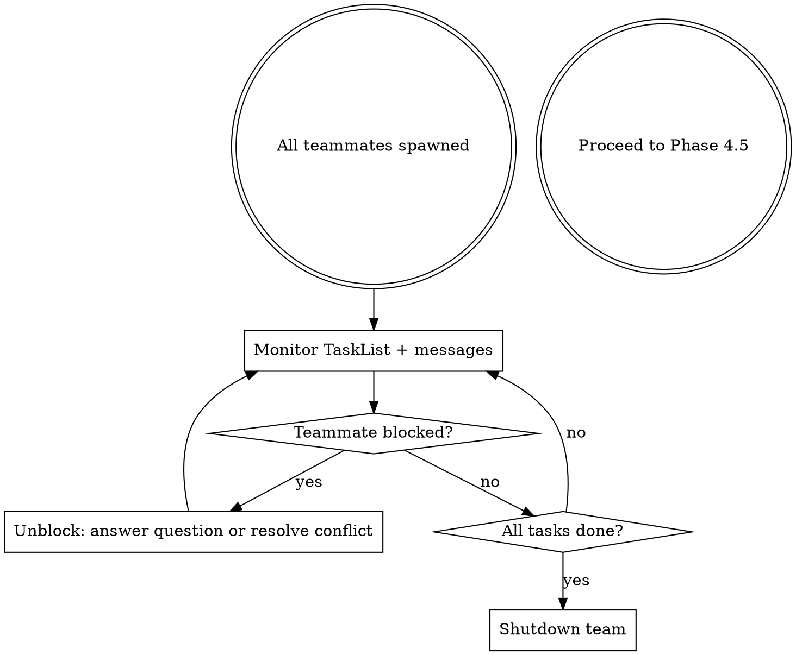

# go-team

Cross-layer development pipeline using Agent Teams. You are the **team lead**.

Phases 1-3 (Brainstorm, Research, Plan), 3.5 (Audit Design), and 4.5-6 (Verify, Review, Land) are identical to `/go`. This skill replaces **Phase 4: Implement** only.

**Worktree detection from `/go` applies here.** If already inside a worktree, skip worktree
creation — you are already isolated.

**You MUST follow `/go` for all non-Phase-4 phases — including:**

- **Phase 3.5**: Invoke `convex-audit-design` on approved plans touching `convex/`. Do NOT skip.
- **Phase 6**: Invoke `finishing-a-development-branch` to merge and clean up. Do NOT merge or clean up manually.

## When to Use

- Feature touches 2+ layers (convex + frontend, backend + tests, all three)
- User says "go team" or "use teams"
- Teammates need to coordinate on shared interfaces (API contracts, schema shape)

Use regular `/go` for single-layer work or tasks where workers don't need to talk to each other.

## Phase 4: Team Implementation

### Step 1: Create the Team

```
TeamCreate({
  team_name: "{ticket-or-feature-slug}",
  description: "Implementing {feature description}"
})
```

You MUST call TeamCreate BEFORE spawning any agents. Without this, there is no team.

### Step 2: Create Tasks from Plan

For each plan item:

```
TaskCreate({
  description: "Implement {specific piece}",
  // blocked_by: [id] for dependencies
})
```

**Partition by file ownership.** Two teammates editing the same file = overwrites. Use this split:

| Teammate   | Owns                               | Never touches        |
| ---------- | ---------------------------------- | -------------------- |
| `backend`  | `convex/**`                        | `frontend/**`        |
| `frontend` | `frontend/src/**`                  | `convex/**`          |
| `tester`   | `**/*.test.ts`, `**/*.e2e-spec.ts` | Implementation files |

Use 2 teammates for medium features, 3 for large. Backend + frontend is the minimum useful team.

Set task dependencies: backend tasks first (schema, mutations) → frontend tasks (components, services) → test tasks (E2E, integration).

### Step 3: Spawn Teammates

**CRITICAL: Both `team_name` AND `name` are required.** Without `team_name`, you get a regular subagent — not a teammate.

```
Agent({
  team_name: "{ticket-or-feature-slug}",
  name: "backend",
  subagent_type: "general-purpose",
  model: "sonnet",
  mode: "auto",
  prompt: "You are the backend teammate on team '{slug}'.

Your tasks:
1. Read team config: ~/.claude/teams/{slug}/config.json
2. Check TaskList for unassigned tasks you can claim
3. Claim tasks with TaskUpdate (set owner to your name)
4. Implement using TDD — write tests first
5. Mark tasks completed, then check TaskList for next work
6. Message teammates directly when you produce interfaces they depend on

Rules:
- Only edit files in convex/
- Follow convex/ CLAUDE.md patterns
- Use queryWithRLS/mutationWithRLS for public endpoints
- Message the frontend teammate when you finalize API shapes
- Never push to main or deploy"
})
```

Repeat for `frontend` and `tester` teammates with their respective ownership rules and prompts.

**Customize each prompt** for the specific feature — the template above is a starting point. Include concrete file names, query names, and interface shapes from your plan. A generic prompt produces a confused teammate.

**Spawn teammates in parallel** — send all Agent calls in a single message.

### Step 4: Coordinate as Lead



As lead:

- Messages from teammates arrive automatically — do NOT poll
- Resolve interface mismatches (e.g., frontend expects a field backend hasn't added)
- Assign new tasks as they emerge
- **Idle is normal** — teammates idle after every turn. Send a message to wake them

### Step 5: Shutdown

When all tasks complete:

```
SendMessage({
  to: "backend",
  message: { type: "shutdown_request", reason: "All tasks complete" }
})
```

Send shutdown to each teammate individually. Do NOT broadcast shutdown requests.

## Red Flags: You Spawned Subagents, Not Teammates

| Symptom                               | Cause                             | Fix                          |
| ------------------------------------- | --------------------------------- | ---------------------------- |
| Agent returns a result summary inline | Missing `team_name` on Agent call | Add `team_name` parameter    |
| No idle notifications appear          | Missing `team_name` on Agent call | Add `team_name` parameter    |
| TeamCreate was never called           | Skipped Step 1                    | Call TeamCreate first        |
| Agent can't find TaskList             | Team doesn't exist yet            | Call TeamCreate before Agent |

If ANY of these happen, stop. Delete the subagents. Start over from Step 1.

## NEVER

- Use `dispatching-parallel-agents` — that skill spawns subagents, not teammates
- Skip TeamCreate before spawning agents
- Have two teammates edit the same file
- Broadcast when a direct message works (broadcasts scale linearly with team size)
- Push to `main` or deploy to production
- Merge or clean up worktrees manually instead of invoking `finishing-a-development-branch`.
  "Phases 4.5-6 are identical to /go" means you MUST follow them — including the skill
  invocation. Doing the merge yourself and listing cleanup as "remaining work" is the exact
  failure mode this rule prevents.
- Skip `convex-audit-design` for Convex-touching plans. "Phases 1-3 are identical to /go"
  includes Phase 3.5. A single-pass review is not equivalent to four sequential audit passes.
