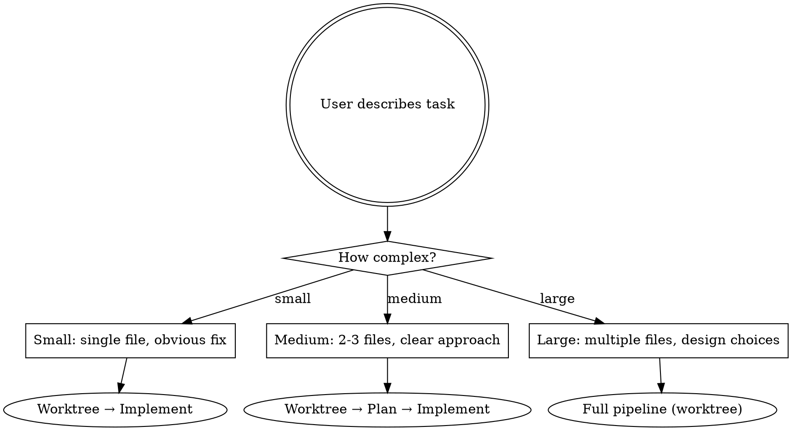

# Go

Full development pipeline. Proceeds automatically between phases; pauses only at decision points marked ⏸.

## Linear Ticket Detection

If the user provides a Linear issue (XML block with `<issue identifier="...">` or a plain identifier like `BRA-17`):

1. Extract the identifier (e.g. `BRA-17`)
2. Immediately mark it **In Progress**: call `mcp__claude_ai_Linear__save_issue` with `id` = the identifier and `state` = `"In Progress"`
3. Carry the identifier through the pipeline — it's needed again in Phase 6

If no Linear ticket is provided, skip this section entirely.

## Triage



**ALL tasks use worktrees — unless you are already in one.** Multiple `/go` sessions, Cyrus
autonomous runs, and interactive work can happen concurrently. Without worktrees, they corrupt
each other's working directory. There is no task small enough to skip isolation.

### Worktree Detection

Before creating a worktree, check: is the current working directory already inside a worktree?

```bash
[[ "$(pwd)" == */braket-tickets/.claude/worktrees/* ]] && echo "IN_WORKTREE" || echo "NOT_IN_WORKTREE"
```

**If already in a worktree:** skip worktree creation entirely. You are already isolated. Work
directly in the current directory on its existing branch. Do NOT create a nested worktree.

**If NOT in a worktree:** create one as usual via `superpowers-extended-cc:using-git-worktrees`.

If unsure about size, ask: "This looks [size] — full pipeline or just implementation?"

## Phase 1: Brainstorm (large only)

Invoke `superpowers-extended-cc:brainstorming`.

⏸ **PAUSE** — Ask targeted follow-up questions. Wait for answers.

## Phase 2: Research

Automatically invoke — no permission needed.

**Determine affected domains first**, then load the right skills and tools:

| Domain                 | Skills to invoke                                                                                                                                                                                                                                                                                                                                             | MCP tools                          |
| ---------------------- | ------------------------------------------------------------------------------------------------------------------------------------------------------------------------------------------------------------------------------------------------------------------------------------------------------------------------------------------------------------ | ---------------------------------- |
| Backend (`convex/`)    | `convex-functions`, `convex-best-practices`, plus any specific skill (`convex-realtime`, `convex-schema-validator`, `convex-file-storage`, `convex-security-check`, etc.)                                                                                                                                                                                    | `functionSpec`, `tables`, `status` |
| Frontend (`frontend/`) | `frontend-design` + Angular CLI `get_best_practices` + `search_documentation`. Also load any relevant Impeccable skills (`animate`, `adapt`, `arrange`, `typeset`, `colorize`, `delight`, `onboard`, `harden`, `clarify`, `polish`, `distill`, `overdrive`, `bolder`, `quieter`, `normalize`, `extract`, `critique`, `audit`, `optimize`) based on the task. | Context7 for ZardUI or new deps    |
| Auth                   | `convex-setup-auth`                                                                                                                                                                                                                                                                                                                                          | —                                  |
| Migrations             | `convex-migration-helper`, `convex-migrations`                                                                                                                                                                                                                                                                                                               | —                                  |
| Both                   | Load both domain skill sets                                                                                                                                                                                                                                                                                                                                  | Both MCP tool sets                 |

**This is mandatory, not optional.** If the task touches `convex/`, at minimum `convex-functions` and `convex-best-practices` must be loaded. If it touches `frontend/`, Angular CLI best practices and `frontend-design` must be loaded. Load specific Convex skills (realtime, file-storage, cron-jobs, etc.) when the task clearly involves those patterns.

Summarize findings briefly, then proceed.

## Phase 3: Plan

Invoke `superpowers-extended-cc:write-plan`.

⏸ **PAUSE** — Present plan. Wait for approval or adjustments.

## Phase 3.5: Audit Design (Convex tasks)

If the plan touches `convex/`, invoke `convex-audit-design` on the approved plan. This runs
four sequential audit passes (best practices, security, performance, code quality) and applies
findings between each pass.

**You MUST invoke the skill — do NOT substitute your own review.** The skill enforces a
structured four-pass audit with fixes applied between passes. Doing a single "looks good to me"
review misses cross-cutting concerns that only surface when earlier findings are resolved first.
"I already reviewed the plan" is not a reason to skip — the skill's value is in the sequential
structure, not just the review itself.

Proceed automatically after audit — no pause needed.

## Phase 4: Implement

1. Create worktree via `superpowers-extended-cc:using-git-worktrees` — unless already in a worktree (see Worktree Detection above)
2. Follow `superpowers-extended-cc:test-driven-development` — write tests before implementation code
3. **Dispatch subagents** via `superpowers-extended-cc:dispatching-parallel-agents`
   - Subagents default to `model: "sonnet"`
   - Use `model: "opus"` only for architectural decisions or complex logic

**You MUST use the Agent tool for implementation work.** Do NOT implement plan tasks inline in the main session. The main session is the coordinator — it dispatches, monitors, and integrates. It does not write implementation code.

If a plan has 2+ independent tasks, dispatch them as parallel subagents. If tasks are sequential, dispatch them one at a time. Either way, use the Agent tool — not inline implementation.

**Red flags that you're doing it inline (STOP and dispatch instead):**

- You're about to call Edit/Write on an implementation file
- You're writing component code, queries, mutations, or test files directly
- You rationalize "it's faster to just do it here" or "I already have the context"
- Context pressure is high — this means you NEED subagents, not that you should skip them

Proceed automatically unless blocked.

## Phase 4.5: Verify

Run BEFORE code review, not after:

1. `superpowers-extended-cc:verification-before-completion` — unit tests must pass
2. `./scripts/validate.sh all` — lint, type-check, build
3. Run affected E2E tests via the `run-e2e` skill (affected-only, never full suite)

All three must pass before proceeding to review. Do NOT run E2E again later — the commit hook handles that.

**When tests fail:** Fix the implementation code, not the tests. Never modify a test to make it pass — the test describes correct behavior. If a test expectation is genuinely wrong (e.g., contradicts the spec from Phase 3), flag it to the user before changing it.

## Phase 5: Review

Invoke `superpowers-extended-cc:requesting-code-review`.

**Domain-specific review criteria** — the code reviewer MUST check:

- **Convex code**: RLS usage on public endpoints, argument validation, proper use of `query`/`mutation`/`action` boundaries, no `any` types, index usage. Invoke `convex-security-check` on any new/modified Convex functions.
- **Angular code**: Zoneless patterns, signal-based reactivity, CDK harness testability, no deprecated APIs. Verify against Angular CLI `get_best_practices`.
- **Both**: TypeScript strict compliance, no `any`.

⏸ **PAUSE** — Present findings. Ask which issues to address (if any).

Fix accepted issues → re-verify (unit tests only, E2E already passed) → proceed.

## Phase 6: Land

⏸ **PAUSE** — Show change summary. Confirm before committing.

Invoke `superpowers-extended-cc:finishing-a-development-branch` to commit on `develop`, merge worktree, and clean up.

**You MUST invoke the skill — do NOT merge or clean up manually.** The skill bundles commit,
merge, and worktree removal as one atomic sequence. Doing the merge yourself skips cleanup,
leaving orphaned worktrees. "I already merged" is not a reason to skip the skill — it's
evidence you already violated this rule.

**After successful commit:** If a Linear ticket was detected at the start, mark it **Done**: call `mcp__claude_ai_Linear__save_issue` with `id` = the identifier and `state` = `"Done"`. Do this after the commit succeeds, not before.

## Phase Transitions

Announce each transition — don't ask permission:

> "Marked BRA-17 In Progress. Researching Convex schema and Angular patterns..."
> "Plan approved. Setting up worktree and dispatching implementation..."
> "All checks green. Starting code review..."
> "Review clean. Ready to land on develop."
> "Committed on develop. Marked BRA-17 Done."

## Skip Rules

| User says                          | Effect                                                              |
| ---------------------------------- | ------------------------------------------------------------------- |
| "skip brainstorm" or provides spec | Start at Plan                                                       |
| "just do it" or provides plan      | Start at Implement (still uses worktree)                            |
| "bugfix" with obvious cause        | Use `superpowers-extended-cc:systematic-debugging`, skip brainstorm |

## NEVER

- Push to `main` or deploy to production
- Skip verification before code review
- Run E2E tests twice (once in Verify, commit hook handles the rest)
- Pause between Research and Plan (no decision needed)
- Ask permission to research — just do it
- Skip worktree creation when running from the main working directory — even for "small" or
  "quick" tasks. Multiple sessions share the working directory. Without a worktree, they
  corrupt each other's uncommitted changes, staged files, and git state. (Exception: if
  already inside a worktree, you are already isolated — do not create a nested one.)
- Merge or clean up worktrees manually instead of invoking `finishing-a-development-branch`.
  The skill exists because merge + cleanup must happen together. Doing the merge yourself and
  then listing cleanup as "remaining work for the user" is the exact failure mode this rule
  prevents.
- Leave orphaned worktrees. If you created a worktree, you own its cleanup. Period.
- Skip `convex-audit-design` for Convex-touching plans. A single-pass "looks fine" review is
  not equivalent to the skill's four sequential audit passes. The passes build on each other —
  security findings change after best-practice fixes are applied. Skipping the skill means
  shipping a plan that was never properly audited.
