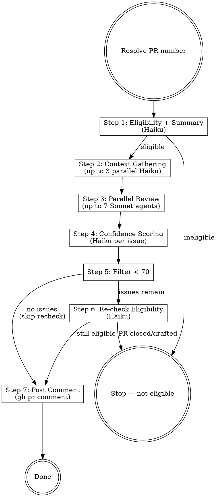

# PR Code Review

Autonomous multi-agent PR review. Combines general code quality (bugs, CLAUDE.md, git history) with Convex and Angular domain expertise. Posts scored findings as a PR comment.

## Input

PR number as argument, or auto-detect from current branch:
```bash
PR_NUMBER=${ARG:-$(gh pr view --json number -q .number 2>/dev/null)}
```

If no PR exists for the current branch, stop and tell the user.

## Execution Flow



Execute every step in order. Do not skip steps. Do not merge steps.

---

### Step 1 — Eligibility + Summary (Haiku agent)

Dispatch a Haiku agent that:
1. Checks eligibility — stop if the PR is (a) closed, (b) a draft, (c) trivially automated / obviously fine, or (d) already has a review comment from you.
2. If eligible, returns:
   - One-paragraph summary of the change
   - File list grouped by layer: `convex/`, `frontend/`, other
   - Boolean flags: `touchesConvex`, `touchesFrontend`

This must complete before Step 2 because context gathering depends on which layers are touched.

### Step 2 — Context Gathering (up to 3 parallel Haiku agents)

Use the `touchesConvex` / `touchesFrontend` flags from Step 1 to decide which agents to launch.

**Agent A — CLAUDE.md Discovery** *(always runs):*
List all `CLAUDE.md` and `AGENTS.md` files relevant to the changed paths. Always include root. Include `convex/CLAUDE.md` and `frontend/CLAUDE.md` if those layers are touched.

**Agent B — Convex Guidelines** *(skip if `touchesConvex` is false):*
Read `convex/_generated/ai/guidelines.md` and `convex/CLAUDE.md`. Return key rules as a compact checklist.

**Agent C — Angular Best Practices** *(skip if `touchesFrontend` is false):*
Call `angular-cli` MCP `get_best_practices` with the workspace path from `list_projects`. Also read `frontend/CLAUDE.md`. Return combined checklist.

### Step 3 — Parallel Review (up to 7 Sonnet agents)

Launch these agents in parallel. Each receives the PR diff (`gh pr diff {PR_NUMBER}`), the summary from Step 3, and relevant context from Step 2.

**Agent 1 — CLAUDE.md Compliance:**
Audit changes against all CLAUDE.md / AGENTS.md files. Flag violations with the specific rule quoted.

**Agent 2 — Bug Scan:**
Shallow scan for bugs: logic errors, off-by-one, null/undefined mishandling, race conditions. Ignore style, formatting, and anything a linter catches.

**Agent 3 — Git History Context:**
Read `git blame` and `git log` for modified files. Flag changes that contradict established patterns or revert intentional prior decisions.

**Agent 4 — Previous PR Comments:**
Check previous PRs touching these files (`gh pr list --search`). Flag issues raised before that may recur here.

**Agent 5 — Code Comment Compliance:**
Read comments (`TODO`, `HACK`, `IMPORTANT`, `WARNING`, `NOTE`) in modified files. Flag changes that violate guidance in those comments.

**Agent 6 — Convex Backend Review** *(skip if `touchesConvex` is false):*
Review against the checklist from Step 2B plus these rules:

- Public endpoints use `queryWithRLS()` / `mutationWithRLS()` from `convex/lib/rls.ts`
- Argument and return validators complete — no `v.any()`
- Indexes exist for every `withIndex()` call and belong to the correct table
- Internal functions use `internalQuery` / `internalMutation` / `internalAction`
- `ctx.scheduler` only in mutations, never actions
- Error messages sanitized — no internal state leaks to clients
- RBAC checks present for protected operations
- No N+1 patterns (sequential `db.get()` in loops — use batch or index scan)
- `patch()` with `undefined` does NOT clear fields — handle explicitly
- Rate limiting on public-facing mutations
- TypeScript strict — no `any`, use `unknown` + narrowing
- Return validators updated when spreading docs with new schema fields

**Agent 7 — Angular Frontend Review** *(skip if `touchesFrontend` is false):*
Review against the checklist from Step 2C plus these rules:

- Standalone components (no NgModules, do not set `standalone: true`)
- Zoneless: no `NgZone`, no `ChangeDetectorRef.detectChanges()`, no `zone.js` import
- Signals: `signal()`, `computed()`, `input.required<T>()`, `output<T>()` — not `@Input`/`@Output`
- `inject()` for DI, never constructor injection
- `@if` / `@for` (with `track`) / `@switch` — not `*ngIf` / `*ngFor`
- Signal Forms (`form()` API), not Reactive Forms
- `resource()` / `rxResource()` for async data, not `ngOnInit`
- No `subscribe()` in components — use `toSignal()` or async pipe
- `[class.x]` bindings, not `ngClass` / `ngStyle`
- Tests use CDK Harnesses, not `nativeElement.querySelector`
- `loadComponent:` (lazy) on route definitions, not `component:`
- `data-testid` on E2E-critical elements (both mobile and desktop variants)

### Step 4 — Confidence Scoring (parallel Haiku agents)

For EACH issue from Step 4, dispatch a Haiku agent with:
- The PR diff via `gh pr diff` (**not** local files — local files read `develop`, not the feature branch)
- The issue description and originating agent
- Relevant CLAUDE.md content

Score 0–100:

| Score | Criteria |
|-------|----------|
| 0 | False positive, doesn't survive scrutiny, pre-existing issue |
| 25 | Might be real, unverified. Stylistic issue not in CLAUDE.md |
| 50 | Verified real, but nitpick or rarely hit in practice |
| 75 | Verified, impacts functionality, or violates a documented rule |
| 100 | Confirmed, frequent in practice, direct evidence in diff |

**Domain scoring guidance:** For Convex/Angular issues (Agents 6–7), score higher if the violated rule appears verbatim in `convex/CLAUDE.md`, `frontend/CLAUDE.md`, or `convex/_generated/ai/guidelines.md`. A violation of a documented project rule scores ≥75. A general best-practice suggestion without project-level documentation scores ≤50.

### Step 5 — Filter

Drop all issues scoring below **70**. If none remain, skip Step 6 and post "no issues" in Step 7.

### Step 6 — Re-check Eligibility (Haiku agent)

Confirm the PR is still open and not a draft. If it changed, stop.

### Step 7 — Post Comment

Use `gh pr comment {PR_NUMBER} --body "..."` with this format:

```markdown
### Code review

Found N issues:

1. **[convex]** Brief description (Rule: "quoted rule")

   https://github.com/OWNER/REPO/blob/FULL_SHA/path/file.ts#L10-L15

2. **[frontend]** Brief description (Rule: "quoted rule")

   https://github.com/OWNER/REPO/blob/FULL_SHA/path/file.ts#L20-L25

3. **[general]** Brief description (Source: git history / prior PR / code comment)

   https://github.com/OWNER/REPO/blob/FULL_SHA/path/file.ts#L30-L35

---
**Reviewed:** bugs, CLAUDE.md compliance, git history, Convex patterns, Angular best practices
```

If zero issues:
```markdown
### Code review

No issues found. Reviewed for bugs, CLAUDE.md compliance, Convex patterns, and Angular best practices.
```

**Link format requirements:**
- Full git SHA (not abbreviated, not `$(git rev-parse HEAD)`)
- `#L{start}-L{end}` with 1 line context above and below
- Repo name matching the PR's repository

---

## False Positive Guide

Give this verbatim to ALL review agents (Step 4) and scoring agents (Step 5):

**Not an issue (do NOT flag):**
- Pre-existing problems not introduced by this PR
- Issues a linter, typechecker, or CI would catch (imports, types, formatting)
- General code quality without a specific documented rule violation
- Issues on lines the PR did not modify
- Intentional functionality changes directly related to the PR's purpose
- CLAUDE.md rules silenced by inline ignore comments
- Style preferences not documented in any CLAUDE.md
- Missing tests unless CLAUDE.md explicitly requires them for this change type

**Real issues (DO flag):**
- RLS bypass on a public endpoint
- Missing or incomplete validators
- `any` in a TypeScript strict codebase
- Zoneless violations (`NgZone`, `ChangeDetectorRef.detectChanges()`)
- Security issues (injection, data leaks, auth bypass)
- Patterns contradicting git history or prior PR feedback
- Documented CLAUDE.md rule violation with specific citation

---

## Red Flags — You Are About to Shortcut

| Thought | Do this instead |
|---------|----------------|
| "I'll review it myself" | Dispatch the agents. They have checklists you'll forget. |
| "I'll merge Convex and Angular into one agent" | Separate domains prevent cross-contamination. Two agents. |
| "Small PR, skip scoring" | One false positive erodes trust. Always score. |
| "Only frontend files but I'll run Convex agent too" | Respect skip logic. False domain matches are noise. |
| "Scoring agents can just read local files" | Local files = `develop` branch. Use `gh pr diff`. |
| "I'll batch all issues into one scoring call" | One Haiku per issue. Batching degrades accuracy. |
| "PR looks fine, I'll post 'no issues' directly" | Run all steps. That's the point of automation. |
