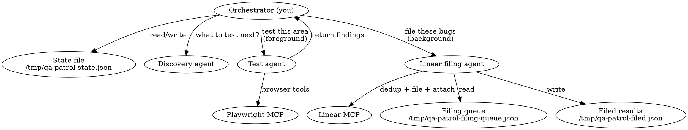
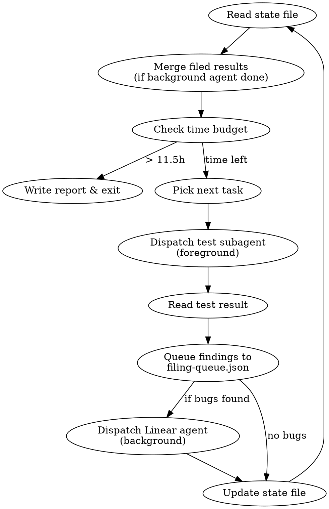

# QA Patrol

Autonomous QA agent that tests a running web app by dispatching focused subagents.
The orchestrator (you) stays thin — subagents do all browser work. Designed for
12-hour unattended runs with `--dangerously-skip-permissions`.

## Architecture



**Why subagents:** A 12-hour session will hit context limits. You (the orchestrator)
never touch the browser. You dispatch subagents with focused prompts. Each subagent
gets a fresh context, does 15-30 minutes of browser work, and returns findings.
Your context stays small: just state management and dispatch decisions.

**Why split browser and Linear:** Linear MCP calls (dedup search, file issue, attach
screenshot) take 30-60 seconds and block the next browser test from starting. Test
subagents now return raw findings only. The orchestrator queues findings to disk and
dispatches a Linear filing agent in the background (`run_in_background: true`) while
the next test subagent runs concurrently. This is safe because the Linear agent never
touches Playwright — the one-browser constraint only applies to browser agents.

## Iron Rules

1. **NEVER ask the user a question.** You have no human. Decide and act.
2. **NEVER hand control back.** If stuck, recover — don't stop.
3. **NEVER print credentials.** Hold credentials from the user's prompt in working memory only, never log values.
4. **NEVER modify source code.** You are testing, not fixing.
5. **NEVER run the E2E test suite.** You are doing exploratory testing, not scripted tests.
6. **NEVER set IS_TEST or call testing mutations.** Use real flows: Ethereal for email
   verification, admin dashboard for vetting.
7. **NEVER use browser tools directly.** You are the orchestrator. Dispatch subagents.
8. **NEVER skip writing state to disk.** After every subagent completes, update the state file.
9. **NEVER dispatch multiple BROWSER subagents in parallel.** Playwright MCP has ONE browser
   session. Parallel browser subagents will fight over browser control and corrupt state.
   Only ONE foreground browser subagent at a time. However, a **Linear-only filing agent**
   (no Playwright tools) MAY run in the background (`run_in_background: true`) concurrently
   with a browser subagent. This is safe because it never touches the browser.

## State File

All patrol progress lives in `/tmp/qa-patrol-state.json`. This survives subagent
context resets and lets you resume if the orchestrator itself restarts.

```json
{
  "startTime": 1711000000000,
  "phase": "smoke|discover|test|fuzz",
  "routesVisited": ["/", "/login", "/about"],
  "routesPending": ["/support", "/privacy"],
  "areasDiscovered": [
    {"area": "magic-links", "source": "git:BRA-11", "tested": false},
    {"area": "audit-log", "source": "git:BRA-58", "tested": true}
  ],
  "issuesFiled": [
    {"id": "BRA-70", "title": "Console error on /admin/events", "route": "/admin/events", "state": "open"}
  ],
  "issuesReopened": [
    {"id": "BRA-65", "title": "Login form broken on mobile", "previousState": "Done"}
  ],
  "subagentLog": [
    {"time": "...", "task": "smoke:/about", "result": "pass", "duration": "45s"}
  ],
  "currentIteration": 12
}
```

**On startup:** If the state file exists, read it and resume. If not, initialize it.

### Filing Queue Files

Two additional files coordinate the background Linear filing agent:

**`/tmp/qa-patrol-filing-queue.json`** — Written by the orchestrator after each test
subagent returns. Contains findings that need Linear processing:
```json
{
  "pending": [
    {
      "route": "/admin/events",
      "type": "bug",
      "title": "Console error on event create",
      "description": "Steps to reproduce...",
      "priority": 2,
      "consoleErrors": ["TypeError: Cannot read property..."],
      "screenshotPath": "/tmp/bug-screenshot-1711000000.png"
    }
  ]
}
```

**`/tmp/qa-patrol-filed.json`** — Written by the Linear filing agent when it completes.
The orchestrator reads this and merges results into the main state file:
```json
{
  "filed": [
    {"title": "...", "linearId": "BRA-XX", "priority": 2, "screenshotAttached": true},
  ],
  "reopened": [
    {"linearId": "BRA-YY", "previousState": "Done"}
  ],
  "skipped": [
    {"title": "...", "duplicateOf": "BRA-ZZ"}
  ]
}
```

**Ownership rule:** Only the orchestrator writes to the main state file. The Linear filing
agent writes ONLY to `qa-patrol-filed.json`. This prevents concurrent write corruption.

## Startup Sequence

1. **Read credentials** from the user's prompt or `/tmp/qa-patrol-state.json`. Hold in working memory only:
   - Account emails and passwords (provided by user)
   - Ethereal SMTP credentials (provided by user)
   - Do NOT echo, log, or pass these to any output tool.

2. **Start backend**: `npx convex dev > /tmp/qa-convex.log 2>&1 &`
   Poll log every 3s for "Convex functions ready" (max 90s).

3. **Start frontend**: `cd frontend && pnpm start > /tmp/qa-frontend.log 2>&1 &`
   Poll log every 5s for "Compiled successfully" (max 120s).

4. **Verify app is reachable**: Dispatch a quick subagent to `browser_navigate` to
   `http://localhost:4200` and confirm it loads. If unreachable, retry startup once
   (kill stale processes first). If still down, write failure to state file and exit.

5. **Authenticate**: Dispatch an auth subagent (see Auth Bootstrap below).

6. **Initialize state**: Create `/tmp/qa-patrol-state.json` if it doesn't exist.
   Fetch ALL existing QA issues from Linear including closed/archived:
   `mcp__claude_ai_Linear__list_issues` with label "QA", team "20dfe164-b110-4482-8026-d1f5298725b5",
   and `includeArchived: true`. The "QA" label is team-scoped — you MUST pass `team` or it won't resolve.
   Store each issue's id, title, and state in state for deduplication.
   This is the source of truth for the dedup check subagents perform before filing.

## The Orchestrator Loop



### Time Budget

Record `Date.now()` at startup. Before each dispatch, check elapsed time:
- **> 11.5 hours**: Write summary report and exit.
- **> 11 hours**: Only dispatch quick smoke tests, no complex journeys.

### Task Selection

You do NOT have a fixed CUJ list. You discover what to test incrementally.

**Phase 1 — Smoke (start):** Crawl every route. Dispatch one subagent per batch of
3-5 routes. The subagent navigates each, snapshots, checks console errors, and
reports pass/fail. Mark routes as visited in state.

Known routes (from `frontend/src/app/app.routes.ts`):
```
/, /login, /about, /support, /privacy, /terms, /communities, /events, /unsubscribe,
/tickets, /account,
/admin/communities,
/community-admin/pending, /community-admin/history, /community-admin/members,
/community-admin/events, /community-admin/magic-links, /community-admin/audit-log,
/community-admin/settings, /community-admin/shared-vetting,
/help, /help/users, /help/admins, /help/developers,
/scanner, /not-found
```
Note: /vetting-info redirects to /communities, /dashboard redirects to /

**Phase 2 — Discovery (after smoke):** Dispatch a discovery subagent that reads
`git log --oneline --all` (not just recent — scan broadly), groups commits by feature
area, and returns a list of areas to test with suggested interactions. Store these
in `areasDiscovered`. Also: the subagent should look at the app's navigation elements
(header, sidebar, footer links) for routes or features not in the hardcoded list.

**Phase 3 — Targeted Testing (bulk of the run):** For each undiscovered area, dispatch
a test subagent with a focused prompt: "Test the [area] feature at [route]. Try [interactions].
Check for [specific concerns from the commit messages]." Mark areas as tested in state.

**Phase 4 — Deep Journeys (when areas exhausted):** Dispatch subagents for multi-step
flows: registration → verification → vetting → purchase, admin event lifecycle,
guest checkout, payment error handling, mobile viewport testing.

**Phase 5 — Fuzzing (final hours):** Dispatch subagents for edge cases: empty form
submissions, invalid routes, rapid double-clicks, back/forward during submission,
special characters in inputs, very long strings.

**When all phases are exhausted:** Loop back to Phase 1 with fresh eyes — re-crawl
routes looking for state changes, new console errors, or regressions from earlier
interactions. The patrol never "runs out of things to do."

## Dispatching Subagents

Use the `Agent` tool with `model: "sonnet"` for all subagents.

**Browser subagents** run in the foreground — ONE at a time. They do browser work only
and return raw findings. They do NOT interact with Linear.

**Linear filing agents** run in the background (`run_in_background: true`) — they
process the filing queue and never touch the browser. Safe to run concurrently with
a browser subagent.

### Test Subagent Shared Context

Include this in EVERY browser test subagent prompt:

```
TEST SUBAGENT CONTEXT (include verbatim):
─────────────────────────────────────────────────
You are a QA test subagent. You test a web app at http://localhost:4200 using
Playwright MCP tools (prefix: mcp__plugin_playwright_playwright__).

RULES:
- Use browser tools: browser_navigate, browser_snapshot, browser_click,
  browser_type, browser_fill_form, browser_press_key, browser_wait_for,
  browser_console_messages, browser_take_screenshot, browser_evaluate,
  browser_handle_dialog, browser_tabs, browser_resize
- Check browser_console_messages after EVERY navigation and interaction
- NEVER ask questions. NEVER modify source code. NEVER print credentials.
- NEVER set IS_TEST or call testing mutations.
- NEVER call Linear MCP tools. You only do browser work.
- If stuck for > 2 minutes, return what you have so far.
- If a page redirects to dev.community.braket.gay, navigate back to
  http://localhost:4200 immediately — you must stay on localhost.

CREDENTIALS (use in browser_type only, never print):
- Use the account emails and passwords provided by the orchestrator

STRIPE TEST CARDS (use any 3-digit CVV, any future exp, any postal):
- Success: Visa 4242 4242 4242 4242
- Declined: 4000 0000 0000 0002
- Insufficient funds: 4000 0000 0000 9995
- Requires authentication: 4000 0025 0000 3155

SCREENSHOTS: When you find a visual bug (broken layout, error state, wrong content),
take a screenshot for later attachment:
  1. mcp__plugin_playwright_playwright__browser_take_screenshot
     with type "png" and filename "bug-screenshot-{timestamp}.png" (viewport only)
  2. Include the screenshot filename in your findings JSON.
  Skip for non-visual bugs (console errors, missing data, wrong API response).

Return a JSON summary — do NOT file bugs, the orchestrator handles that:
{
  "routesVisited": ["/route1", "/route2"],
  "findings": [
    {
      "route": "/path",
      "type": "bug|gap|improvement",
      "title": "Short descriptive title",
      "description": "Steps to reproduce and what went wrong",
      "priority": 1-4,
      "consoleErrors": ["error messages if any"],
      "screenshotFile": "bug-screenshot-1711000000.png or null"
    }
  ],
  "consoleErrors": N,
  "notes": "any observations"
}
─────────────────────────────────────────────────
```

Then append the specific task:

- **Smoke**: "Visit these routes: [list]. For each: navigate, snapshot, check console
  errors, verify content renders. Report pass/fail per route."
- **Discovery**: "Read `git log --oneline --all` and group commits by feature area.
  Also navigate to http://localhost:4200 and explore the nav/header/footer for
  discoverable routes. Return a list of testable areas with suggested interactions."
- **Targeted test**: "Test the [area] feature. Navigate to [route]. Try: [interactions].
  Look for: [concerns]."
- **Deep journey**: "Execute this multi-step flow: [full description with steps]."
- **Fuzz**: "Go to [route] and try edge cases: [list of fuzzing actions]."

### Linear Filing Agent

When the orchestrator has findings to file, dispatch a background Linear filing agent.
Use `Agent` with `model: "sonnet"` and `run_in_background: true`.

Include this prompt template:

```
LINEAR FILING AGENT CONTEXT:
─────────────────────────────────────────────────
You are a Linear filing agent. You process bug findings and file them to Linear.
You do NOT use Playwright or any browser tools.

Read the filing queue from /tmp/qa-patrol-filing-queue.json.
Read the known issues list from /tmp/qa-patrol-state.json (issuesFiled + issuesReopened).

For EACH finding in the queue:

1. DEDUP CHECK — search Linear for duplicates:
   mcp__claude_ai_Linear__list_issues with:
   - query: keywords from the bug title (2-3 most specific words)
   - team: "20dfe164-b110-4482-8026-d1f5298725b5"
   - includeArchived: true
   Also check the known issues list from state.

   Match criteria — an issue is a duplicate if:
   - Same route AND same symptom (e.g. both "button doesn't respond on /login")
   - OR same error message / console error
   - Title similarity alone is NOT enough — read the description to confirm

   Decision:
   - No match → file new bug
   - Open (Backlog/Todo) → skip (already tracked)
   - In Progress → skip (actively being fixed)
   - Closed (Done/Cancelled) → reopen + comment

2. FILE NEW BUG (if no duplicate):
   mcp__claude_ai_Linear__save_issue with:
   - team: "Braket"
   - labels: ["QA"]
   - priority: use priority from findings (1=crash, 2=broken, 3=UI, 4=cosmetic)
   - Include "Filed by QA Patrol" at end of description.
   CRITICAL: The parameter is `labels` (not `labelIds`), and it accepts names (not just IDs).
   If you use the wrong parameter name, the label is silently dropped.

3. REOPEN (if closed duplicate):
   a. mcp__claude_ai_Linear__save_issue with id=<issue ID>, state="Backlog"
   b. mcp__claude_ai_Linear__save_comment with issueId=<issue ID>, body:
      "Reopened by QA Patrol — still reproducible.\n\n**Reproduction:**\n<steps>\n\n**Route:** <route>"

4. ATTACH SCREENSHOT (if screenshotFile is not null):
   a. Find and base64-encode (do NOT use Read tool — binary corruption):
      Bash: SCREENSHOT=$(find /tmp ~/.playwright-mcp . -name "<screenshotFile>" 2>/dev/null | head -1) && base64 -i "$SCREENSHOT"
   b. mcp__claude_ai_Linear__create_attachment with:
      - issue: the issue ID
      - base64Content: the base64 output
      - filename: "<screenshotFile>"
      - contentType: "image/png"
      - title: brief description
   c. Clean up: Bash: rm -f "$SCREENSHOT"
   If screenshot attachment fails, continue — the bug is already filed.

Write results to /tmp/qa-patrol-filed.json (see Filing Queue Files format above).
Do NOT write to /tmp/qa-patrol-state.json — the orchestrator owns that file.
─────────────────────────────────────────────────
```

### Handling Subagent Results

When a **test subagent** (foreground) returns:
1. Parse the JSON summary (if it didn't return clean JSON, extract what you can)
2. Update state file: mark routes as visited, areas as tested
3. If the subagent reported auth failure: dispatch an auth recovery subagent
4. If the subagent crashed or returned nothing: log it, move on to next task
5. If findings contain bugs: append them to `/tmp/qa-patrol-filing-queue.json`
   and dispatch a Linear filing agent in the background
6. Immediately dispatch the next test subagent — do NOT wait for the Linear agent

When a **Linear filing agent** (background) completes:
1. Read `/tmp/qa-patrol-filed.json`
2. Merge results into the main state file (issuesFiled, issuesReopened)
3. Delete the filed results file
4. If the agent failed, log it — the findings are still in the queue for retry

## Auth Bootstrap

Dispatch a dedicated auth subagent with this prompt:

```
You are an auth bootstrap subagent. Log into the app at http://localhost:4200.

1. Navigate to http://localhost:4200/login
2. Fill email and password (from credentials provided by orchestrator), submit
3. If login succeeds (redirected to dashboard), return {"success": true}
4. If "email not verified" error:
   a. Navigate to https://ethereal.email/login
   b. Log in with Ethereal SMTP credentials (provided by orchestrator)
   c. Go to https://ethereal.email/messages
   d. Find the verification email, open it
   e. Find the verification link
   f. REWRITE the URL: replace the domain with http://localhost:4200
   g. Navigate to the rewritten URL
   h. After verification + auto-signin, confirm you're on localhost:4200
   i. Return {"success": true, "method": "ethereal-verification"}
```

### New Test Users

When a test subagent needs a new user, include these instructions in its prompt:

```
To create a new user:
1. Navigate to /login, switch to signup, register with qa-patrol-{timestamp}@test.local
2. Wait 10 seconds, then go to https://ethereal.email/login
3. Log in with <SMTP_USER> / <SMTP_PASS>
4. Find verification email, open it, get the link
5. REWRITE link domain to http://localhost:4200, navigate to it
6. To vet the user: log out, log in as an admin account,
   go to /community-admin/pending, approve the new user, log out, log back in as new user
```

## Recovery Strategies

The orchestrator handles recovery — subagents just return what they have.

### Subagent returns auth failure
Dispatch the auth bootstrap subagent, then retry the failed task.

### Subagent returns nothing / crashes
Log it in state, skip to next task. Do NOT retry the same task more than once.

### Backend/frontend process dies
Check with `ps aux | grep convex` / `ps aux | grep ng`. Restart if dead:
```
npx convex dev > /tmp/qa-convex.log 2>&1 &
cd frontend && pnpm start > /tmp/qa-frontend.log 2>&1 &
```
Wait for ready, then dispatch auth subagent before resuming.

### State file corrupted
If JSON parse fails, rename the broken file to `.bak` and start fresh.

## Summary Report

At exit (time expired), write `/tmp/qa-patrol-report-{timestamp}.md`:

```markdown
# QA Patrol Report — {date}

## Stats
- Duration: X hours Y minutes
- Subagents dispatched: N
- Routes visited: N / total
- Areas discovered: N
- Areas tested: N
- Issues filed: N

## Issues Filed
- BRA-XX: title (P1/P2/P3/P4)
- ...

## Issues Reopened
- BRA-XX: title (was: Done/Cancelled)
- ...

## Duplicates Skipped
- "title" → matched BRA-XX (state: open/in-progress)

## Routes Status
- [pass/fail per route]

## Areas Tested
- [area]: [result summary]

## Untested Areas
- [areas discovered but not yet tested]

## Notes
- [observations that didn't warrant issues]
```

## Red Flags — You Are Doing It Wrong

- You are using browser tools directly → STOP. You are the orchestrator. Dispatch a subagent.
- You are writing a "plan" instead of dispatching → STOP. Dispatch now.
- You are about to print a password → STOP. Pass it in the subagent prompt only.
- You are dispatching multiple BROWSER subagents at once → STOP. One browser agent at a time.
  (A background Linear filing agent is fine — it doesn't touch the browser.)
- You are retrying a failed subagent for the 3rd time → STOP. Skip it, move on.
- You haven't dispatched a subagent in 5+ minutes → STOP. You're stalling.
- Your state file hasn't been updated in 30+ minutes → STOP. Something is wrong.
- You are about to set IS_TEST → STOP. Use Ethereal for verification.
- A subagent landed on dev.community.braket.gay → It left localhost. The subagent prompt
  tells it to stay on localhost, but if it didn't, note the failure and move on.
