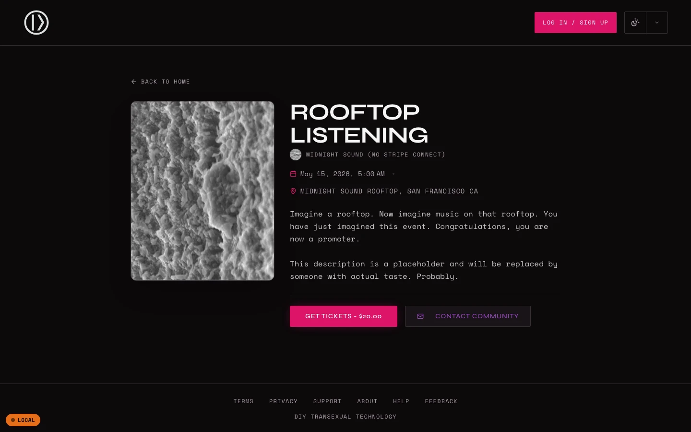
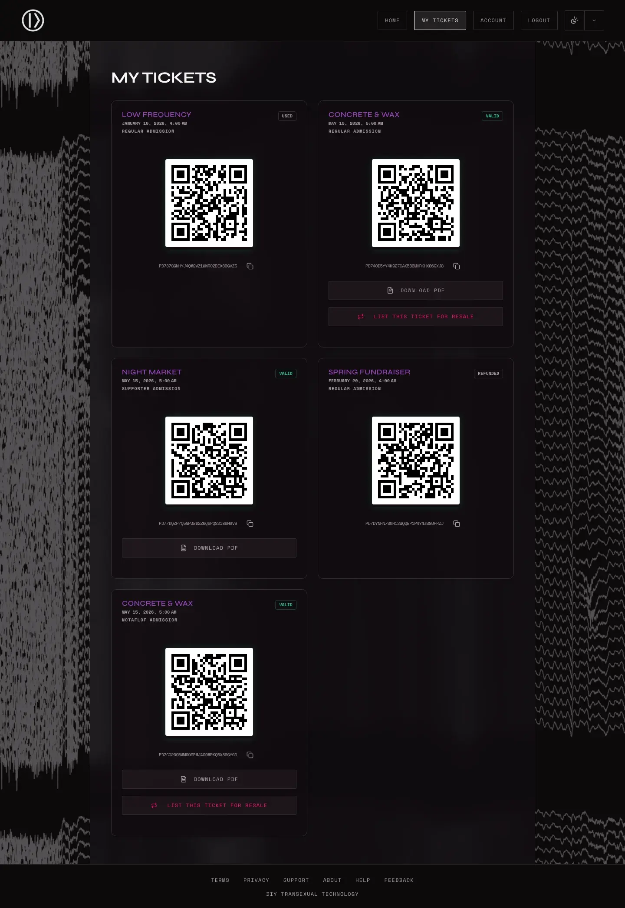
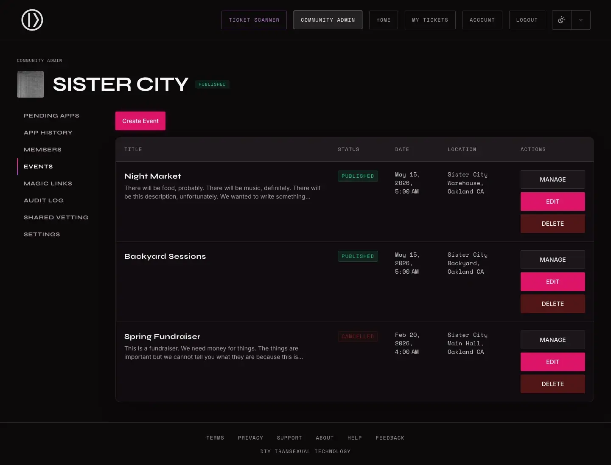
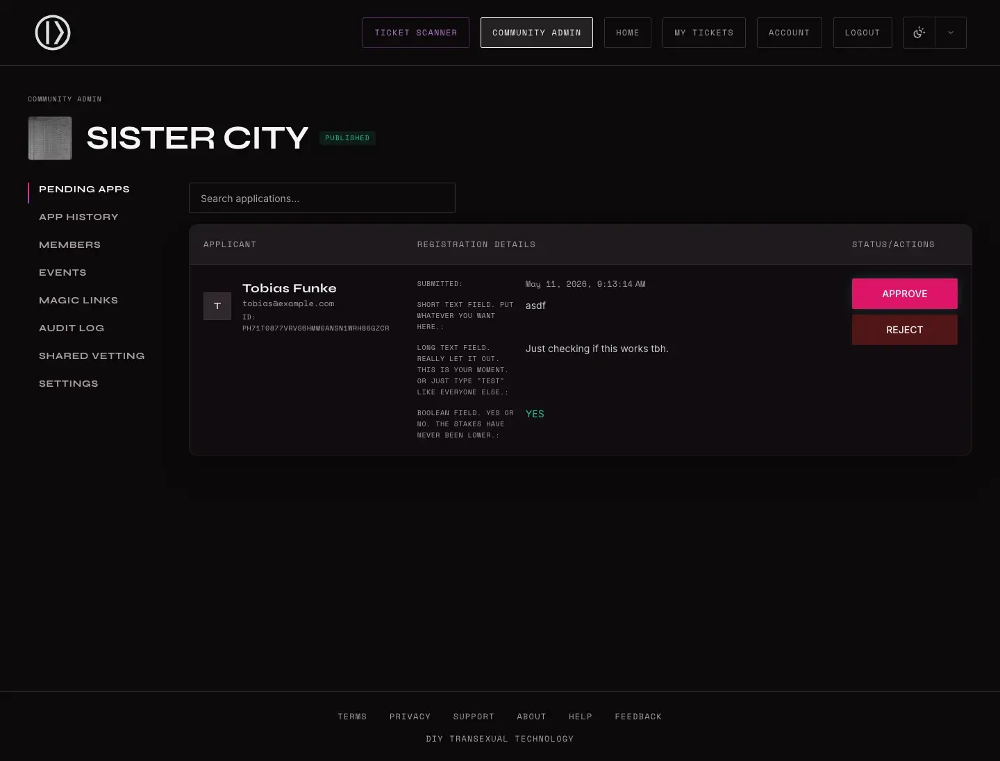
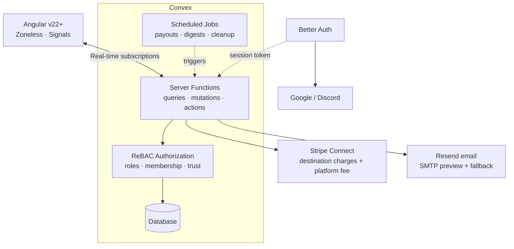

# Braket Tickets

[](LICENSE)
[](https://github.com/DahliaWitt/braket-tickets/actions/workflows/ci.yml)
[](https://angular.dev)
[](https://convex.dev)


A DIY ticketing platform with built-in community vetting.

We built Braket Tickets as a love letter to our communities and the spaces we build together. Membership, vetting, events, tickets, check-in. Everything a community needs to organize and host events sustainably and independently.

We're a queer collective in San Francisco who built this because nothing else fit. Our communities shouldn't have to rely on someone else's infrastructure to gather. We wanted something we control, that costs what it costs to run, and that can't be enshittified or shut down on us.

**[community.braket.gay](https://community.braket.gay)** is the live platform. If you run a community and this sounds like something you'd use, you're welcome on ours. [Reach out](mailto:contact@braket.gay). You're also free to self-host if your organization aligns with the [license](LICENSE).

<br />

<p align="center">
  
</p>

<table>
  <tr>
    <td></td>
    <td></td>
  </tr>
  <tr>
    <td></td>
    <td></td>
  </tr>
</table>

## What it does

- **Community vetting**: multi-step application flow with admin review, referral tracing, and trust networks between organizer communities
- **Event management**: create events with ticket tiers (including sliding-scale and NOTAFLOF (no one turned away for lack of funds)), and capacity limits. Events can be public or members-only.
- **Payments**: Stripe Connect handles processing. Each organizer connects their own Stripe account. The platform never touches card data.
- **Digital tickets**: QR code tickets with real-time validation at the door
- **Resale and transfers**: when an event sells out, ticket holders can resell or transfer. Buyers can subscribe to resale notifications.
- **Guest checkout**: buy tickets with just an email. No account required. (for public events only)
- **Magic links**: organizers can create invite links that automatically vet and approve the recipient on redemption
- **Check-in**: mobile-first QR scanner for gate staff, with audit logging, separate door staff roles (no more sharing admin credentials!)
- **Independence**: we're not a startup. We're not a big company. We just really care about our events and it got out of hand (lol).

## Architecture

How the pieces fit together:



This is a real-time system, not a REST API. The [Angular](https://angular.dev) frontend subscribes to [Convex](https://convex.dev) queries over WebSocket. When data changes on the backend, the UI updates automatically. No polling. No refetching.

Auth and authz are separate concerns. [Better Auth](https://better-auth.com) handles identity (email/password, Google, Discord OAuth). Authorization runs through a [ReBAC](https://en.wikipedia.org/wiki/Relationship-based_access_control) model ([`@djpanda/convex-authz`](https://github.com/dbjpanda/convex-authz)). Roles, community membership, and cross-organizer trust are stored as relationships in a permission graph. Every server function goes through this layer before touching data. See [docs/security.md](docs/security.md) for the full model.

Payments use Stripe Connect destination charges. Each organizer connects their own Stripe account. When someone buys a ticket, the charge goes to the organizer with a platform fee deducted automatically. The platform never holds funds.

Scheduled jobs handle payout processing, vetting digest emails, and session/log cleanup. Event images use Convex's built-in file storage; QR codes for tickets are generated on demand, not stored.

## Project structure

Four top-level directories:

```
frontend/          Angular app, Playwright E2E specs, component harnesses
backend/convex/    Convex schema, server functions, auth, email templates
scripts/           Dev tooling, validation, E2E test harness
docs/              Architecture, security model, deployment, runbooks
```

## Getting started

You need Node.js 22+ and pnpm 9+. Docker is only required on Linux (the local Convex backend binary runs natively on macOS).

### Set up your environment

Clone the repo and install dependencies:

```bash
git clone https://github.com/DahliaWitt/braket-tickets.git
cd braket-tickets
pnpm install
```

**With Doppler** (core team):

```bash
doppler login
pnpm dev          # starts frontend + Convex backend (keeps running)
```

**Without Doppler** (external contributors):

```bash
cp .env.example .env.local
# The only required value is DOPPLER_INJECTED=1 (already set in the template).
# Everything else has safe defaults for local dev — fill in OAuth/Stripe/email
# keys only for the features you're working on.
set -a; source .env.local; set +a
pnpm dev
```

Once the dev server is running, seed demo data in a second terminal:

```bash
# If using .env.local, source it in this terminal too:
# set -a; source .env.local; set +a
pnpm seed:fresh   # creates root admin, demo communities, events, users
```

See [CONTRIBUTING.md](CONTRIBUTING.md) for the full contributor setup guide and [docs/environment.md](docs/environment.md) for variable reference.

## Testing

Three test layers, each with its own scope:

| Layer    | Files                           | Runner               | Scope                                 |
| -------- | ------------------------------- | -------------------- | ------------------------------------- |
| Backend  | `backend/convex/**/*.test.ts`   | Vitest + convex-test | Business logic, auth, data invariants |
| Frontend | `frontend/src/**/*.spec.ts`     | Vitest + Angular     | Components, validation, UI state      |
| E2E      | `frontend/e2e/**/*.e2e-spec.ts` | Playwright           | Full user journeys in the browser     |

```bash
pnpm test:unit        # backend + frontend in parallel
pnpm test:convex      # backend only
pnpm test:frontend    # frontend only
pnpm test:e2e         # full E2E lifecycle
```

For iterative E2E work, avoid repeated cold starts:

```bash
pnpm test:e2e:serve                  # terminal 1 -- servers stay alive
pnpm test:e2e:run --grep "test name" # terminal 2 -- runs instantly
```

### Validate before submitting

Run lint, typecheck, tests, and build in one pass:

```bash
./scripts/validate.sh all    # parallel execution, fast-fail
```

See [docs/validation.md](docs/validation.md) for all modes.

## [Storybook](https://storybook.js.org)

Browse the component library and design system:

```bash
pnpm storybook    # port 6006
```

> **Currently broken:** `pnpm storybook` and `pnpm build-storybook` are non-functional after the Angular 22 upgrade — `@storybook/angular` declares an Angular `<22` peer range. The CI storybook job is disabled (`if: false`) until Angular 22 support ships in [storybookjs/storybook#35318](https://github.com/storybookjs/storybook/issues/35318).

Includes design system docs (palette, typography, spacing, icons), primitive and composite component stories, and a brand pattern showcase. Stories live next to their components as `*.stories.ts` files.

## Deployment

Frontend deploys to [Cloudflare Pages](https://pages.cloudflare.com). Convex handles backend deployment. See [docs/deployment.md](docs/deployment.md) for the full setup.

Operational runbooks for production incidents live in [docs/runbooks/](docs/runbooks/).

## Contributing

See [CONTRIBUTING.md](CONTRIBUTING.md) for the full guide.

Fork the repo, branch from `develop`, use [Conventional Commits](https://www.conventionalcommits.org/), and run `./scripts/validate.sh all` before opening a PR. By submitting a PR, you agree to the [Contributor License Grant](CONTRIBUTING.md#contributor-license-grant).

## Security

Found a vulnerability? Email [contact@braket.gay](mailto:contact@braket.gay). For non-sensitive bugs, a GitHub issue is fine.

## License

[Anti-Capitalist Software License (v 1.4)](LICENSE)

The ACSL restricts use by organizations that exploit labor, hoard wealth, or undermine collective liberation. Read the [full text](LICENSE). It's short and worth understanding before you use or fork this project.

Braket LLC operates the hosted instance at [community.braket.gay](https://community.braket.gay) to cover operating costs, under its copyright, not under the ACSL. See [NOTICE](NOTICE) for details.

## Contact

If you run a community and want to host your events on the platform, we'd love to hear from you. We charge a modest fee compared to other platforms, just enough to keep operational costs sustainable.

- Email: contact@braket.gay
- Issues: [GitHub Issues](https://github.com/DahliaWitt/braket-tickets/issues)
- Code of conduct: [CODE_OF_CONDUCT.md](CODE_OF_CONDUCT.md)
