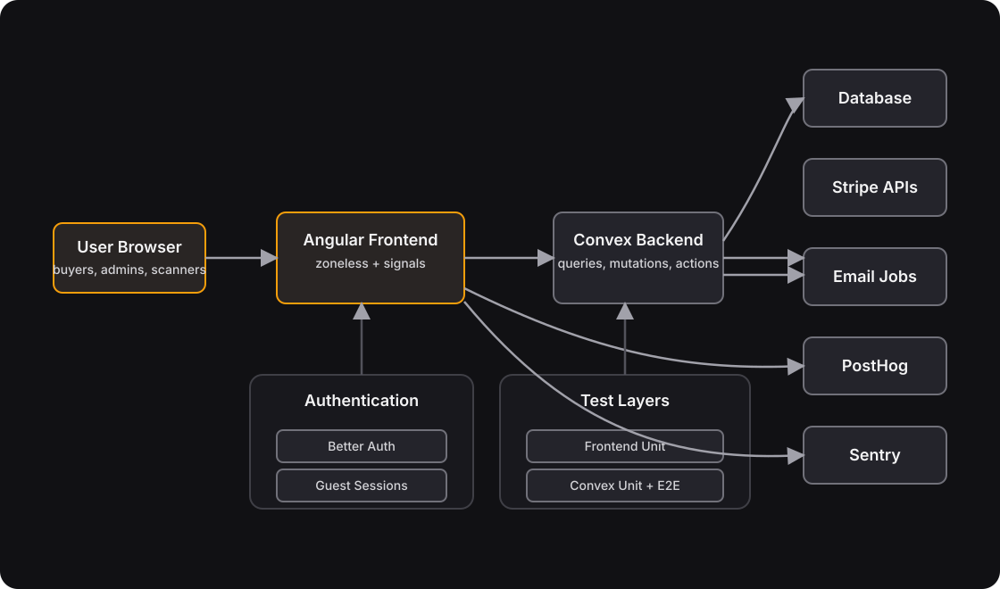

# Braket Tickets Architecture



## Data Access Patterns

Frontend code uses two paths to read Convex data, chosen by auth requirement and change frequency.

### Subscriptions (WebSocket)

Authenticated, frequently-changing data uses `injectQuery()` over the Convex WebSocket connection (`convexUrl`, port 3210 locally). The client holds a persistent connection and re-evaluates automatically when underlying data changes.

Examples: `getUserApprovals`, `getMyApplications`, `getEventAvailability`.

Use when:

- Data is user-specific and requires auth context
- Sub-second reactivity matters (approval status, ticket availability)
- Client count is bounded by authenticated users

### HTTP Endpoints

Public, slow-changing data uses Angular `HttpClient` against Convex HTTP actions (`convexSiteUrl`, port 3211 locally). Responses carry cache headers and are rate-limited by IP.

Examples: `/api/communities` (public directory), `/api/events/upcoming` (public event list), `/api/events/{id}` (single-event preview, used for OG link-unfurl metadata).

Use when:

- No auth required — unauthenticated visitors need the data
- Data changes infrequently (community directory, upcoming event list)
- CDN/browser caching reduces backend load (`Cache-Control: public, max-age=60, stale-while-revalidate=300`)
- IP-based rate limiting is needed to protect against abuse

### Implementation Pattern

HTTP actions wrap internal queries to keep logic testable and reusable:

```
httpAction(handler)
  → ctx.runQuery(internal.domain.queryName, {})
    → shared model function (e.g. loadPublicDirectoryCommunities)
```

The HTTP layer adds caching, CORS, and rate limiting. The internal query holds the actual data logic and can be called from tests or other server-side code without the HTTP surface.

### Frontend Wiring

| Pattern                                            | Import           | Reactivity        | Auth     |
| -------------------------------------------------- | ---------------- | ----------------- | -------- |
| `injectQuery(api.fn, () => args)`                  | `convex-angular` | Live subscription | Required |
| `resource({ loader: () => httpService.method() })` | `@angular/core`  | One-shot fetch    | None     |

Both patterns produce signals consumed by Angular's change detection. Feature data ownership belongs in services when the same read feeds multiple presentation derivations or combines with other dashboard/page data. Components should keep `injectQuery()` or `resource()` only for page-local, presentation-only reads whose lifecycle is unique to that component.

Service-owned reads expose typed signals such as `approvals`, `myApplications`, or `publicCommunities`; components derive view models from those signals. This keeps Convex subscription details, HTTP resource loaders, loading flags, and safe resource reads out of templates and presentation components.
