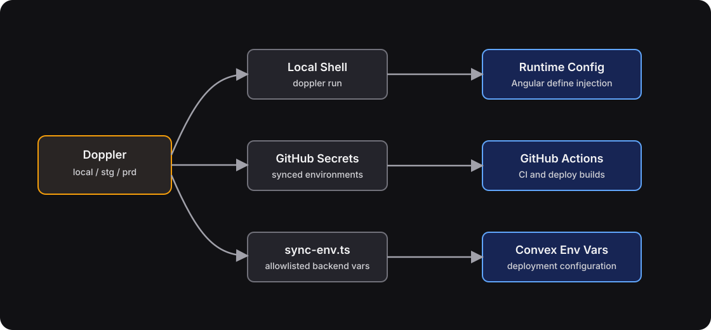

# Environment Variable Management

This repo is now Doppler-first.

## Golden Rule

Do not create or rely on local `.env` files. Doppler is the single source of truth for app config and secrets.

## Environment Mapping

- `local`: local development on your machine
- `stg`: staging config, synced into the GitHub `development` environment and the Convex development deployment
- `prd`: production config, synced into the GitHub `production` environment and the Convex production deployment

## Architecture



## Local Development

### With Doppler (Recommended)

```bash
doppler login
pnpm dev
```

Use the same pattern for tests and scripts:

```bash
pnpm test:frontend
pnpm test:e2e:serve
pnpm seed:fresh
pnpm seed:fixture
```

When `pnpm test:e2e:serve` is running, local E2E backends use an ephemeral port. `pnpm seed:fresh` auto-detects the current local backend via `.convex-local/.e2e-convex-url` so you do not need to set `CONVEX_URL` in Doppler for local E2E runs.

Common local repo entrypoints now auto-run through Doppler's `local` config when `DOPPLER_CONFIG` is not already set. They use explicit project/config flags, so separate worktrees do not need their own `doppler setup` entry. Raw Convex commands should run from the repo root, for example `doppler run -p braket-tickets -c local -- pnpm convex dev`.

### Contributing without Doppler

If you don't have Doppler access, use [.env.example](../.env.example) instead:

1. Copy it:

   ```bash
   cp .env.example .env.local
   ```

2. Export the variables before running anything (`set -a` makes them visible to child processes):

   ```bash
   set -a; source .env.local; set +a
   pnpm dev
   ```

#### Minimum required

The only variable strictly required to bypass the Doppler CLI check is:

```bash
DOPPLER_INJECTED=1
```

The dev harness automatically generates safe defaults for:

- `SITE_URL` (from the Angular dev server port)
- `CONVEX_SITE_URL` and `AUTH_BASE_URL` (from the Convex backend port)
- `BETTER_AUTH_SECRET` (a dev-only placeholder)
- CORS (allowed automatically when SITE_URL contains `localhost` or `127.0.0.1`)

With just `DOPPLER_INJECTED=1`, `pnpm dev` starts successfully and you can browse the app, run frontend tests, and run E2E tests. Features that require external services will be unavailable until you add their credentials.

#### Feature availability without credentials

| Feature                              | Required credentials                                      | Fallback without them                                 |
| ------------------------------------ | --------------------------------------------------------- | ----------------------------------------------------- |
| Browse app, view pages               | None                                                      | Works                                                 |
| Email/password auth                  | None                                                      | Works (uses auto-generated auth secret)               |
| Google/Discord OAuth                 | `GOOGLE_CLIENT_ID`/`SECRET`, `DISCORD_CLIENT_ID`/`SECRET` | Social login buttons fail; email/password still works |
| Email sending (magic links, invites) | `SMTP_*` (free from [Ethereal](https://ethereal.email/))  | Emails silently dropped                               |
| Payments & checkout                  | `STRIPE_SECRET_KEY`, `STRIPE_PUBLISHABLE_KEY`             | Payment flows error                                   |
| Stripe webhooks                      | `STRIPE_WEBHOOK_SECRET*`                                  | Webhook processing fails                              |
| Analytics                            | `POSTHOG_KEY`                                             | Disabled silently                                     |
| Error tracking                       | `SENTRY_DSN`                                              | Disabled silently                                     |

#### Third-party credential setup

For features you need (port 3211 is the `pnpm dev` default; E2E uses ephemeral ports):

- **Google OAuth** — create credentials in [Google Cloud Console](https://console.cloud.google.com/apis/dashboard). Set authorized redirect URI to `http://127.0.0.1:3211/api/auth/callback/google`.
- **Discord OAuth** — create an app in [Discord Developer Portal](https://discord.com/developers/applications). Set redirect URI to `http://127.0.0.1:3211/api/auth/callback/discord`.
- **Email** — grab free test credentials from [Ethereal Email](https://ethereal.email/). Emails are captured in a web inbox instead of delivered.
- **Stripe** — use test API keys from [Stripe Dashboard](https://dashboard.stripe.com/apikeys). For webhook testing, use `stripe listen --forward-to http://127.0.0.1:3211/stripe-webhook`.

This covers dev, frontend tests, and E2E. Observability and deployment workflows still need Doppler.

## GitHub Actions

GitHub Actions consumes secrets that Doppler syncs into the GitHub `development` and `production` environments. Do not edit GitHub secrets by hand. Make changes in Doppler and let the sync update GitHub.

This follows Doppler's GitHub Actions integration, which syncs each selected Doppler config into the chosen GitHub environment and keeps GitHub updated whenever Doppler changes. Source: [Doppler GitHub Actions](https://docs.doppler.com/docs/github-actions).

## Convex

Convex is not the source of truth. Backend variables are pushed from the currently injected environment using `backend/scripts/sync-env.ts`.

Manual sync commands:

```bash
# Staging / Convex development deployment
DOPPLER_CONFIG=stg pnpm sync:env:dev

# Production / Convex production deployment
DOPPLER_CONFIG=prd pnpm sync:env:prod
```

The sync script only pushes an explicit allowlist of backend variables, not every shell variable. GitHub Actions can run `pnpm sync:env:dev` or `pnpm sync:env:prod` directly because the selected environment secrets are already injected by GitHub.

### Backend PostHog Product Analytics Variables

| Variable          | Runtime        | Description                                                                                                                                                                        |
| ----------------- | -------------- | ---------------------------------------------------------------------------------------------------------------------------------------------------------------------------------- |
| `POSTHOG_API_KEY` | Convex backend | PostHog project API key used by `@posthog/convex` for backend product events.                                                                                                      |
| `POSTHOG_HOST`    | Convex backend | PostHog API host for backend capture. If the deploy environment uses `/ingest` for the frontend proxy, `backend/scripts/sync-env.ts` syncs Convex with `https://us.i.posthog.com`. |

### Self-Hosted Observability Variables

Forwarding for Convex logs is controlled by the Docker observability services in `ops/docker-compose.yml`.
The deploy workflows pass these values from the Doppler-synced GitHub environment into `docker compose`.
For PostHog forwarding, the workflows prefer the dedicated `POSTHOG_LOGS_PROJECT_TOKEN` / `POSTHOG_DEV_LOGS_PROJECT_TOKEN` values when present and fall back to the existing project `POSTHOG_KEY`.

- **`CONVEX_LOG_SINK`**: sink for production logs. Defaults to `posthog` in compose.
- **`POSTHOG_LOGS_PROJECT_TOKEN`**: PostHog project token used by the production forwarder.
- **`POSTHOG_LOGS_HOST`**: PostHog ingest host for production, default `https://us.i.posthog.com`.
- **`POSTHOG_LOGS_SERVICE_NAME`**: optional identifier for production service correlation.
- **`CONVEX_DEV_LOG_SINK`**: sink for development logs, defaulting to `posthog` in compose.
- **`POSTHOG_DEV_LOGS_PROJECT_TOKEN`**: PostHog project token for development.
- **`POSTHOG_DEV_LOGS_HOST`**: PostHog ingest host for development, default `https://us.i.posthog.com`.
- **`POSTHOG_DEV_LOGS_SERVICE_NAME`**: optional identifier for development service correlation.

Sentry DSN values remain present for rollback:

- **`SENTRY_DSN`**: production DSN
- **`SENTRY_DSN_DEVELOPMENT`**: development DSN

Rollback path when PostHog ingestion is failing:

1. Set `CONVEX_LOG_SINK=sentry` (or `CONVEX_DEV_LOG_SINK=sentry`) in Doppler for the affected environment.
2. Rerun the matching deploy workflow, or restart the forwarder container from a shell that exports the same env locally:
   - Prod: `docker compose -f ops/docker-compose.yml restart convex-log-forwarder`
   - Preview/dev profile: `docker compose -f ops/docker-compose.yml --profile dev-observability restart convex-log-forwarder-dev`
3. Keep Sentry DSN values unchanged so the rollback target is ready when needed.

## Adding a New Variable

To add a new variable such as `NEW_API_KEY`:

1. Add it to the relevant Doppler configs (`local`, `stg`, `prd`).
2. If the frontend needs it at build time, map it in `frontend/scripts/runtime-config.ts`.
3. If Convex needs it at runtime, add it to the allowlist in `backend/scripts/sync-env.ts`.
4. If CI uses it directly, reference `${{ secrets.NEW_API_KEY }}` in the workflow. Do not set it manually in GitHub; Doppler sync owns that.
5. Verify locally with the normal repo scripts (`pnpm dev`, `pnpm test:frontend`, `./scripts/validate.sh`) or use `doppler run -p braket-tickets -c local -- ...` for raw commands, then verify the relevant deploy path.

## Frontend Build Variables

Frontend values are resolved from `process.env` by `frontend/scripts/runtime-config.ts` and injected into Angular with `--define`.

Common frontend-exposed variables:

- `CONVEX_URL`
- `STRIPE_PUBLISHABLE_KEY`
- `POSTHOG_KEY`
- `POSTHOG_HOST`
- `SENTRY_DSN`

To preserve the Cloudflare proxy routes used in deployed frontend builds, set `POSTHOG_HOST=/ingest` in `stg` and `prd`. Convex backend capture cannot use that relative host; the backend sync script maps `/ingest` to `https://us.i.posthog.com`.

## Authentication Provider Variables (Convex Backend)

Social OAuth providers require these backend variables:

- **`AUTH_BASE_URL`**: root URL used for social callback handling
- **`BETTER_AUTH_SECRET`**: Better Auth signing secret
- **`CONVEX_SITE_URL`**: URL for Convex integration
- **`SITE_URL`**: canonical public origin for this deployment (e.g., `https://community.braket.gay`). Used by `backend/convex/lib/site_url.ts` to build all server-constructed frontend links: auth callbacks, email templates (magic links, invites, broadcasts, reminders, vetting), and Stripe Connect onboarding `return_url` / `refresh_url`. Required in every non-test Convex deployment — Convex actions that build redirect URLs throw when it is unset. Set alongside `AUTH_BASE_URL` when provisioning a new deployment.
- **`TOKEN_DIGEST_SECRET`**: high-entropy Convex backend secret used only to HMAC app-owned bearer tokens before storing them in Convex. Required before deploying token digest hardening code to any non-test deployment. Generate independently per environment and keep it stable; digest-only tokens cannot be re-HMACed without the original raw token.
- **`DISCORD_CLIENT_ID`**
- **`DISCORD_CLIENT_SECRET`**
- **`GOOGLE_CLIENT_ID`**
- **`GOOGLE_CLIENT_SECRET`**
- **`ALLOW_LOCALHOST_CORS`**: allowed only for local/test contexts

See [Social Auth Setup](./runbooks/social-auth-setup.md) for instructions on obtaining Google and Discord credentials.

## ✉️ Email (Resend primary / Ethereal preview / Gmail SMTP fallback)

Backend emails are sent from Convex through the Resend Convex component. Gmail
SMTP is configured only as a critical fallback for auth and ticket-delivery
email when Resend has a pre-acceptance transient failure.

Local and staging deployments use the existing `SMTP_*` settings for Ethereal
preview delivery. Production-like Convex deployments use Resend mode; a missing
`RESEND_API_KEY` there is treated as misconfiguration, not a request to preview.

- **`RESEND_API_KEY`**: Resend API key used for primary email delivery.
- **`RESEND_WEBHOOK_SECRET`**: Resend webhook signing secret for `/resend-webhook`.
- **`EMAIL_FROM`**: Sender address displayed to recipients (for example `tickets@braket.gay`).
- **`EMAIL_REPLY_TO`**: Optional reply-to address (for example `contact@braket.gay`).
- **`SMTP_HOST`**, **`SMTP_PORT`**, **`SMTP_USER`**, **`SMTP_PASS`**: Ethereal preview credentials in local/staging; Gmail fallback credentials in production.
- **`SMTP_FROM`**, **`SMTP_REPLY_TO`**: Temporary sender/reply-to fallback if `EMAIL_FROM` / `EMAIL_REPLY_TO` are not set.

Example production settings with placeholder values only:

```bash
RESEND_API_KEY=re_xxxxxxxxxxxxxxxxxxxxxxxxxxxxxxxx
RESEND_WEBHOOK_SECRET=whsec_xxxxxxxxxxxxxxxxxxxxxxxxxxxxxxxx
EMAIL_FROM=tickets@braket.gay
EMAIL_REPLY_TO=contact@braket.gay
SMTP_HOST=smtp.gmail.com
SMTP_PORT=465
SMTP_USER=<fallback-sender@example.com>
SMTP_PASS=<google-workspace-app-password>
```

Example local/staging preview settings:

```bash
SMTP_HOST=smtp.ethereal.email
SMTP_PORT=587
SMTP_USER=ethereal_user@example.com
SMTP_PASS=ethereal_password
SMTP_FROM=ethereal_user@example.com
```

## 💳 Payment Provider Variables

### Stripe Connect (Primary Payment Provider)

Current payment and payout flows are Stripe-only. No other payment-provider environment variables are used by the repo.

- **`STRIPE_PUBLISHABLE_KEY`** (Frontend): Stripe publishable key for embedded Checkout
- **`STRIPE_SECRET_KEY`** (Backend/Convex): Stripe secret key for Checkout Session creation and Connect operations
- **`STRIPE_WEBHOOK_SECRET`** (Backend/Convex): Webhook signing secret for platform account events
- **`STRIPE_WEBHOOK_SECRET_CONNECT`** (Backend/Convex): Webhook signing secret for connected-account v1 snapshot events
- **`STRIPE_WEBHOOK_SECRET_V2_EVENTS`** (Backend/Convex): Webhook signing secret for Accounts V2 event destinations
- **`STRIPE_SANDBOX_CONNECTED_ACCOUNT_ID`** (Ops/Testing): Shared sandbox Connect account used by automated fixture seeding and sandbox contract tests

```bash
# Development
pnpm convex env set STRIPE_SECRET_KEY sk_test_...
pnpm convex env set STRIPE_WEBHOOK_SECRET whsec_...
pnpm convex env set STRIPE_WEBHOOK_SECRET_CONNECT whsec_...
pnpm convex env set STRIPE_WEBHOOK_SECRET_V2_EVENTS whsec_...

# Production
pnpm convex env set STRIPE_SECRET_KEY sk_live_... --prod
pnpm convex env set STRIPE_WEBHOOK_SECRET whsec_... --prod
pnpm convex env set STRIPE_WEBHOOK_SECRET_CONNECT whsec_... --prod
pnpm convex env set STRIPE_WEBHOOK_SECRET_V2_EVENTS whsec_... --prod
```

Sandbox fixture reseed (local/staging):

```bash
# Local
pnpm seed:fixture

# Staging
doppler run --config stg -- pnpm seed:fixture
```

Sandbox contract tests (deterministic backend lane, no Stripe iframe automation):

```bash
pnpm test:convex:sandbox
```

---

## 🚀 Deployment

### Updating Credentials in Doppler

- Update the target Doppler config: `local`, `stg`, or `prd`.
- Let Doppler sync propagate the change to GitHub environment secrets.
- Re-run the relevant deploy or manual Convex sync command.

### Updating Credentials on Convex

Convex environment variables are derived from Doppler-managed values:

- **Staging:** `DOPPLER_CONFIG=stg pnpm sync:env:dev`
- **Prod:** `DOPPLER_CONFIG=prd pnpm sync:env:prod`
- **List Vars:** `pnpm convex env list`

### Verification

- **Local frontend**: `pnpm --filter frontend build`
- **Unit tests**: `pnpm test:frontend`
- **Production build**: verify the GitHub environment receives the synced secrets and the deploy workflow succeeds
